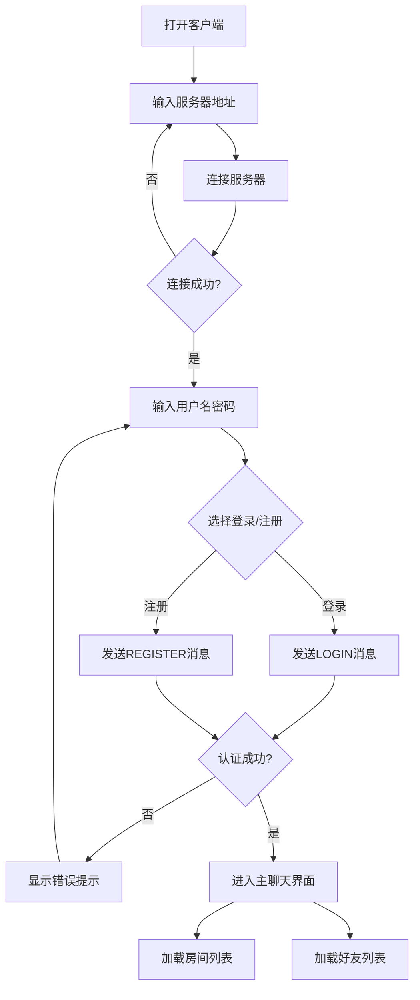
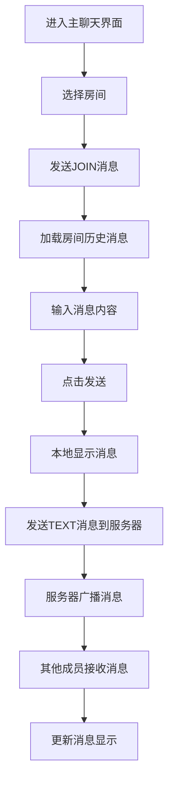
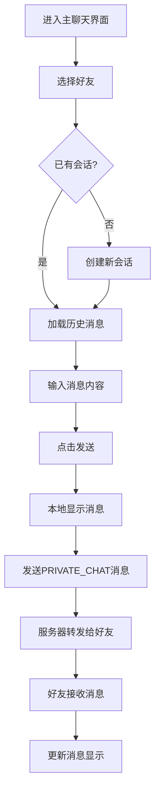
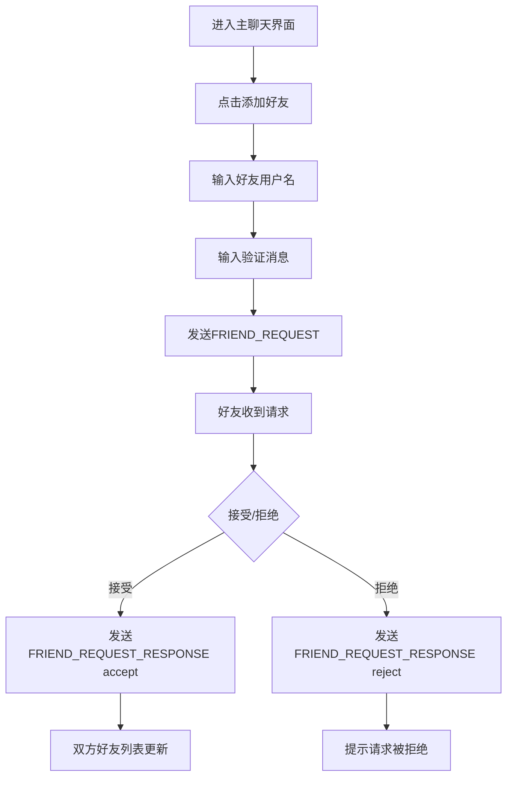
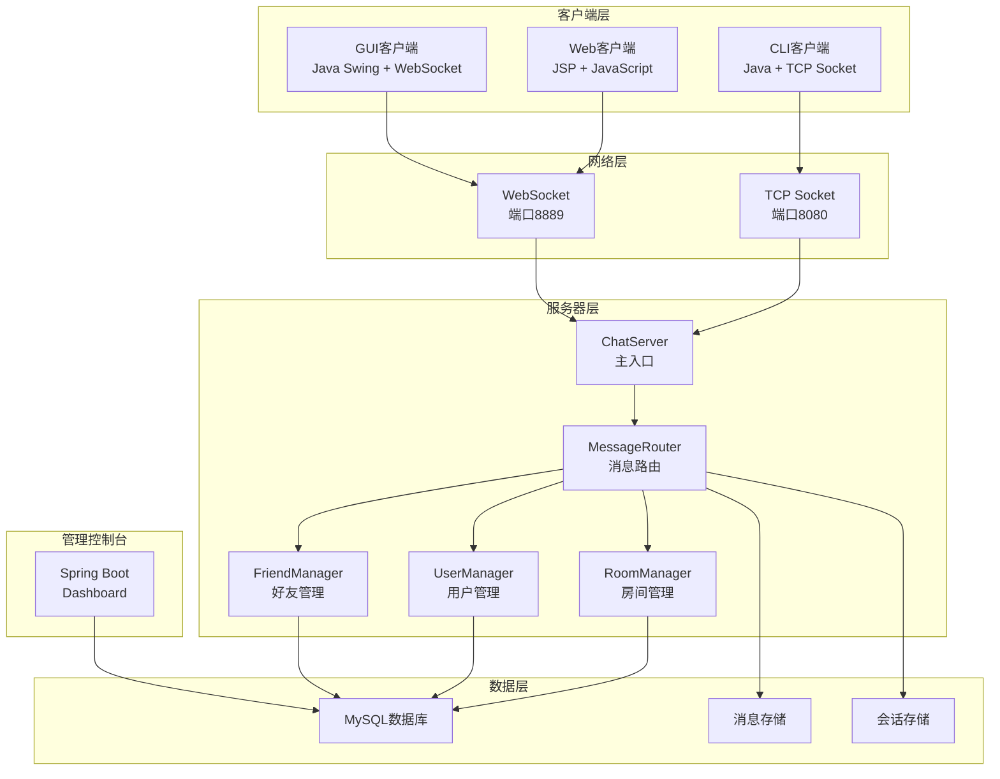

# EJP Chatroom 聊天系统 - 产品需求文档

## 1. 产品概述

EJP Chatroom 是一个基于 Java 的实时聊天系统，支持房间群聊和好友私聊功能。系统采用 C/S 架构，提供多种客户端接入方式（Web、CLI、GUI），满足不同场景下的即时通讯需求。

**目标用户**：需要进行团队协作、社交聊天的用户群体，包括开发人员、学生和普通用户。

**市场价值**：提供轻量级、可定制的聊天解决方案，支持私有化部署，保障数据安全。

---

## 2. 核心功能

### 2.1 用户角色

| 角色 | 注册方式 | 核心权限 |
|------|----------|----------|
| 普通用户 | 用户名密码注册 | 登录、创建/加入房间、添加好友、发送消息 |
| 管理员 | 系统预设 | 管理用户、管理房间、查看消息日志 |

### 2.2 功能模块

1. **用户认证模块**：注册、登录、身份验证
2. **房间管理模块**：创建房间、加入房间、离开房间、房间列表
3. **消息模块**：群聊消息、私聊消息、系统消息
4. **好友模块**：添加好友、好友请求、好友列表、在线状态
5. **管理控制台**：用户管理、房间管理、消息查看

### 2.3 客户端类型

| 客户端类型 | 技术栈 | 特点 |
|------------|--------|------|
| Web 客户端 | JSP + JavaScript + WebSocket | 无需安装，浏览器访问 |
| CLI 客户端 | Java + TCP Socket | 命令行界面，轻量级 |
| GUI 客户端 | Java Swing + WebSocket | 图形界面，操作直观 |

### 2.4 页面/界面详情

#### Web 客户端

| 页面名称 | 模块名称 | 功能描述 |
|----------|----------|----------|
| 登录页 | 登录表单 | 用户输入用户名密码进行登录或注册 |
| 房间选择页 | 房间列表 | 展示所有房间，支持创建和加入房间 |
| 聊天页 | 消息区域 | 消息显示、消息输入、发送按钮、用户列表 |

#### GUI 客户端

| 界面名称 | 模块名称 | 功能描述 |
|----------|----------|----------|
| 连接窗口 | 服务器配置 | 输入服务器IP、端口，连接服务器 |
| 登录窗口 | 登录表单 | 用户输入用户名密码进行登录或注册 |
| 主聊天窗口 | 房间列表 | 展示所有房间，支持创建、加入、离开房间 |
| 主聊天窗口 | 好友列表 | 展示好友列表，支持添加好友、查看请求 |
| 主聊天窗口 | 消息区域 | 消息显示、消息输入、发送按钮 |

#### 管理控制台

| 页面名称 | 模块名称 | 功能描述 |
|----------|----------|----------|
| 首页 | 概览 | 显示系统统计数据（用户数、房间数、消息数） |
| 用户管理 | 用户列表 | 查看所有用户、用户状态、用户详情 |
| 房间管理 | 房间列表 | 查看所有房间、房间成员、房间详情 |
| 消息管理 | 消息列表 | 查看消息记录、消息搜索 |

---

## 3. 核心流程

### 3.1 用户登录流程



### 3.2 房间聊天流程



### 3.3 私聊流程



### 3.4 好友添加流程



---

## 4. 用户界面设计

### 4.1 设计风格

**GUI 客户端设计规范**：

- **主色调**：深蓝色 (#1e3a5f)，搭配白色背景
- **辅助色**：浅蓝色 (#3498db)，用于按钮和高亮元素
- **按钮样式**：圆角矩形，悬停效果，按下状态变化
- **字体**：自动检测系统中文字体（Noto Sans CJK、Microsoft YaHei、PingFang 等）
- **布局**：左侧列表 + 右侧内容的经典聊天布局
- **图标**：使用 Unicode 字符作为简易图标

**Web 客户端设计规范**：

- **主色调**：现代简约风格，灰色系为主
- **按钮样式**：扁平化设计，圆角按钮
- **字体**：系统默认字体，支持中文
- **布局**：响应式布局，支持移动端

### 4.2 GUI 客户端界面设计

#### 连接窗口

| 模块名称 | UI 元素 | 描述 |
|----------|---------|------|
| 标题区域 | 标签 | "EJP Chatroom - 连接服务器" |
| 表单区域 | 文本框 | 服务器IP输入框，默认值"localhost" |
| 表单区域 | 文本框 | 端口输入框，默认值"8889" |
| 表单区域 | 下拉框 | 协议选择（ws/wss） |
| 按钮区域 | 按钮 | "连接"按钮 |
| 状态区域 | 标签 | 连接状态提示 |

#### 登录窗口

| 模块名称 | UI 元素 | 描述 |
|----------|---------|------|
| 标题区域 | 标签 | "EJP Chatroom - 登录" |
| 表单区域 | 文本框 | 用户名输入框 |
| 表单区域 | 密码框 | 密码输入框 |
| 按钮区域 | 按钮 | "登录"按钮 |
| 按钮区域 | 按钮 | "注册"按钮 |
| 状态区域 | 标签 | 登录状态提示 |

#### 主聊天窗口

| 模块名称 | UI 元素 | 描述 |
|----------|---------|------|
| 左侧面板 | 分割面板 | 上下分割，房间列表在上，好友列表在下 |
| 房间列表 | 列表组件 | 显示所有房间，选中状态高亮 |
| 房间按钮 | 按钮组 | 创建房间、加入房间、离开房间 |
| 好友列表 | 列表组件 | 显示所有好友，在线状态标识 |
| 好友按钮 | 按钮组 | 添加好友、好友请求、刷新好友 |
| 右侧面板 | 标签 | 当前聊天对象名称 |
| 消息区域 | 文本面板 | 显示消息内容，支持滚动 |
| 输入区域 | 文本框 | 消息输入框，支持中文输入 |
| 输入区域 | 按钮 | "发送"按钮 |
| 底部按钮 | 按钮 | "退出登录"按钮 |

### 4.3 响应式设计

- **GUI 客户端**：固定窗口大小 (800x600)，支持窗口最大化
- **Web 客户端**：响应式布局，适配不同屏幕尺寸

---

## 5. 技术架构

### 5.1 系统架构图



### 5.2 技术栈

| 层级 | 技术 | 版本 |
|------|------|------|
| 服务器 | Java | 11+ |
| 服务器框架 | 原生 Socket/WebSocket | - |
| WebSocket库 | Java-WebSocket | 1.5.2 |
| 数据库 | MySQL | 5.7+ |
| JSON处理 | Gson | 2.9.1 |
| GUI客户端 | Java Swing | - |
| 管理控制台 | Spring Boot | 2.7+ |
| 管理控制台模板 | Thymeleaf | - |

### 5.3 消息协议

#### 消息格式

```json
{
  "type": "MESSAGE_TYPE",
  "from": "sender_username",
  "content": "message_content",
  "time": "2026-07-04 10:00:00",
  "id": "MESSAGE_ID",
  "conversationId": "123",
  "isNSFW": false,
  "iv": null
}
```

#### 消息类型

| 消息类型 | 用途 | content格式 |
|----------|------|-------------|
| LOGIN | 用户登录 | `username:password` |
| REGISTER | 用户注册 | `username:password` |
| AUTH_SUCCESS | 认证成功 | 成功消息 |
| AUTH_FAILURE | 认证失败 | 失败原因 |
| TEXT | 群聊消息 | `{"conversation_id":N,"content":"msg"}` |
| PRIVATE_CHAT | 私聊消息 | `{"to":"user","content":"msg"}` 或 `{"conversation_id":N,"content":"msg"}` |
| JOIN | 加入房间 | `{"conversation_id":N,"room_name":"name"}` |
| EXIT_ROOM | 离开房间 | 房间名称 |
| CREATE_ROOM | 创建房间 | `room_name:room_type` |
| LIST_ROOMS | 获取房间列表 | 空 |
| ROOM_LIST | 返回房间列表 | `{"rooms":[...]}` |
| FRIEND_REQUEST | 好友请求 | `to:username;message` |
| FRIEND_REQUEST_RESPONSE | 好友请求响应 | `accept:username` 或 `reject:username` |
| REQUEST_FRIEND_LIST | 请求好友列表 | 空 |
| FRIEND_LIST | 返回好友列表 | `[{"username":"user"}]` |
| REQUEST_ALL_FRIEND_REQUESTS | 请求所有好友请求 | 空 |
| ALL_FRIEND_REQUESTS | 返回所有好友请求 | `[{"from_username":"user"}]` |
| USER_STATUS_UPDATE | 用户状态更新 | `{"username":"user","status":"ONLINE","isOnline":true}` |
| SYSTEM | 系统消息 | 消息内容 |

---

## 6. 数据模型

### 6.1 数据库表结构

```mermaid
erDiagram
    USERS {
        int id PK
        varchar username UK
        varchar password
        datetime created_at
        datetime last_login
    }
    
    CONVERSATIONS {
        int id PK
        varchar name
        varchar type "ROOM/PRIVATE"
        datetime created_at
    }
    
    CONVERSATION_MEMBERS {
        int id PK
        int conversation_id FK
        int user_id FK
        datetime joined_at
    }
    
    MESSAGES {
        int id PK
        varchar type
        varchar from_username
        varchar content
        datetime time
        int conversation_id FK
        varchar conversation_type
    }
    
    FRIENDSHIPS {
        int id PK
        int user1_id FK
        int user2_id FK
        datetime created_at
    }
    
    FRIEND_REQUESTS {
        int id PK
        int from_user_id FK
        int to_user_id FK
        varchar message
        varchar status "PENDING/ACCEPTED/REJECTED"
        datetime created_at
        datetime responded_at
    }
    
    USERS ||--o{ CONVERSATION_MEMBERS : "参与"
    CONVERSATIONS ||--o{ CONVERSATION_MEMBERS : "包含"
    CONVERSATIONS ||--o{ MESSAGES : "包含"
    USERS ||--o{ FRIENDSHIPS : "好友关系"
    USERS ||--o{ FRIEND_REQUESTS : "发起/接收请求"
```



### 6.2 核心数据模型定义

#### User（用户）

| 字段 | 类型 | 约束 | 说明 |
|------|------|------|------|
| id | INT | PRIMARY KEY, AUTO_INCREMENT | 用户ID |
| username | VARCHAR(50) | UNIQUE, NOT NULL | 用户名 |
| password | VARCHAR(255) | NOT NULL | 密码（加密存储） |
| created_at | DATETIME | NOT NULL | 创建时间 |
| last_login | DATETIME | NULL | 最后登录时间 |

#### Conversation（会话）

| 字段 | 类型 | 约束 | 说明 |
|------|------|------|------|
| id | INT | PRIMARY KEY, AUTO_INCREMENT | 会话ID |
| name | VARCHAR(100) | NOT NULL | 会话名称 |
| type | VARCHAR(10) | NOT NULL | 会话类型（ROOM/PRIVATE） |
| created_at | DATETIME | NOT NULL | 创建时间 |

#### Message（消息）

| 字段 | 类型 | 约束 | 说明 |
|------|------|------|------|
| id | INT | PRIMARY KEY, AUTO_INCREMENT | 消息ID |
| type | VARCHAR(20) | NOT NULL | 消息类型 |
| from_username | VARCHAR(50) | NOT NULL | 发送者用户名 |
| content | TEXT | NOT NULL | 消息内容 |
| time | DATETIME | NOT NULL | 发送时间 |
| conversation_id | INT | FOREIGN KEY | 会话ID |
| conversation_type | VARCHAR(10) | NOT NULL | 会话类型 |

---

## 7. 部署与运行

### 7.1 服务器部署

#### 环境要求

- Java 11+
- MySQL 5.7+
- Maven 3.6+

#### 配置步骤

1. **数据库配置**：编辑 `server/sql/database.properties`
   ```properties
   db.url=jdbc:mysql://localhost:3306/chatroom
   db.username=chatroom
   db.password=chatroom
   ```

2. **服务配置**：编辑 `server/config/service.properties`
   ```properties
   server.port=8080
   websocket.port=8889
   ```

3. **编译运行**：
   ```bash
   cd server
   mvn clean package
   java -jar target/chatroom-server.jar
   ```

### 7.2 GUI 客户端运行

```bash
cd client/gui
mvn clean package
java -jar target/chatroom-gui-1.0.0.jar
```

### 7.3 Web 客户端部署

- 将 `client/web/` 目录部署到 Tomcat 或其他 Servlet 容器
- 配置 WebSocket 连接地址

### 7.4 管理控制台运行

```bash
cd dashboard
mvn clean package
java -jar target/admin-dashboard.jar
```

---

## 8. 安全考虑

### 8.1 认证安全

- 用户密码使用 AES 加密存储
- 登录失败次数限制
- 会话超时机制

### 8.2 消息安全

- 支持 NSFW 内容检测
- 消息内容过滤
- 私聊仅好友可见

### 8.3 网络安全

- WebSocket 支持 wss 协议
- 防止消息伪造
- SQL 注入防护

---

## 9. 性能要求

### 9.1 响应时间

- 消息发送延迟：< 100ms
- 房间列表加载：< 500ms
- 好友列表加载：< 500ms

### 9.2 并发支持

- 支持 1000+ 在线用户
- 支持 100+ 活跃房间
- 单房间支持 100+ 成员

---

## 10. 版本历史

| 版本 | 日期 | 变更内容 |
|------|------|----------|
| v1.0 | 2026-07-01 | 初始版本，支持房间群聊、用户认证 |
| v1.1 | 2026-07-02 | 添加私聊功能、好友系统 |
| v1.2 | 2026-07-03 | 添加 GUI 客户端 |
| v1.3 | 2026-07-04 | 修复 GUI 客户端 bug（登录格式、中文输入、消息显示） |