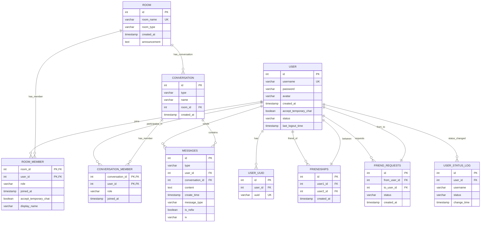
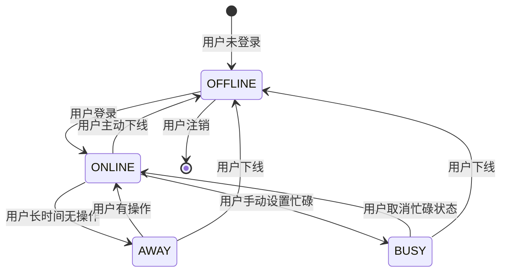
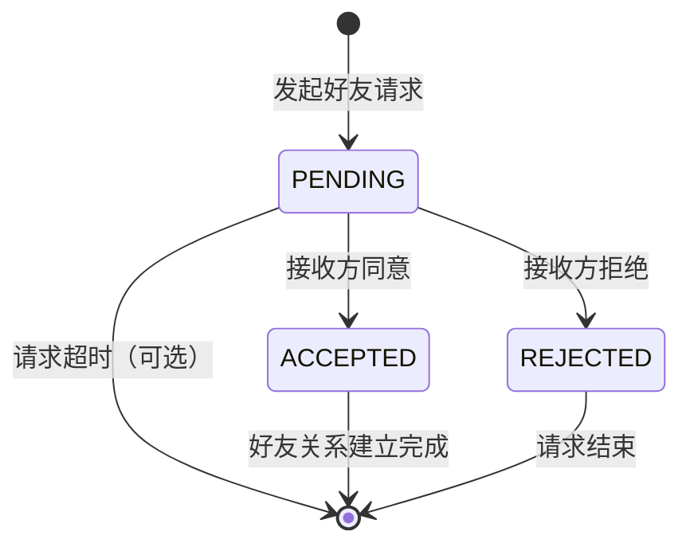
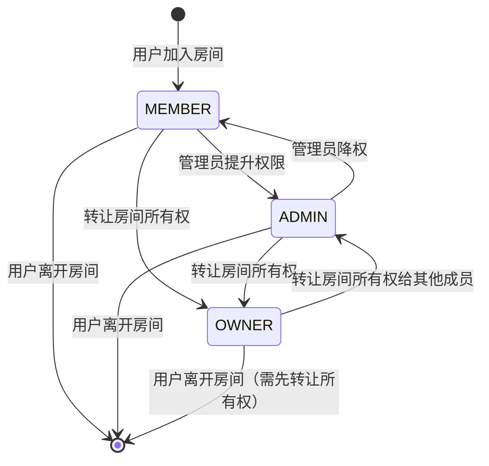

# EJP Chatroom 网络聊天室系统 - 数据库设计文档

## 1. 数据库概述

### 1.1 数据库信息

| 项目 | 说明 |
|------|------|
| 数据库名称 | `chatroom_db` |
| 数据库类型 | MySQL 8.0+ |
| 字符集 | `utf8mb4` |
| 排序规则 | `utf8mb4_unicode_ci` |
| 存储引擎 | InnoDB |

### 1.2 数据库用途

本数据库用于存储 EJP Chatroom 网络聊天室系统的所有业务数据，包括用户信息、房间信息、会话信息、消息记录、好友关系等。

### 1.3 设计原则

1. **规范化设计**：遵循第三范式，减少数据冗余
2. **完整性约束**：通过主键、外键、唯一约束保证数据完整性
3. **性能优化**：合理建立索引，优化查询性能
4. **扩展性设计**：预留字段和表结构，支持未来功能扩展

---

## 2. 数据字典

### 2.1 用户表 (user)

**表说明**：存储系统用户的基本信息

| 字段名 | 类型 | 约束 | 默认值 | 说明 |
|--------|------|------|--------|------|
| id | INT | PRIMARY KEY, AUTO_INCREMENT | - | 用户唯一标识 |
| username | VARCHAR(50) | NOT NULL, UNIQUE | - | 用户名，唯一 |
| password | VARCHAR(255) | NOT NULL | - | BCrypt 加密后的密码 |
| avatar | VARCHAR(255) | - | NULL | 头像文件路径（ZFile 存储） |
| created_at | TIMESTAMP | - | CURRENT_TIMESTAMP | 创建时间 |
| accept_temporary_chat | BOOLEAN | - | TRUE | 是否接受临时聊天 |
| status | VARCHAR(20) | - | 'OFFLINE' | 在线状态（ONLINE/OFFLINE/AWAY/BUSY） |
| last_logout_time | TIMESTAMP | - | NULL | 最后下线时间 |

**索引**：
- 主键索引：`id`
- 唯一索引：`username`

---

### 2.2 用户UUID表 (user_uuid)

**表说明**：存储用户与UUID的映射关系，用于WebSocket连接标识

| 字段名 | 类型 | 约束 | 默认值 | 说明 |
|--------|------|------|--------|------|
| id | INT | PRIMARY KEY, AUTO_INCREMENT | - | 记录唯一标识 |
| user_id | INT | NOT NULL, FOREIGN KEY | - | 用户ID，关联 user(id) |
| uuid | VARCHAR(36) | NOT NULL, UNIQUE | - | WebSocket 连接 UUID |

**索引**：
- 主键索引：`id`
- 唯一索引：`uuid`
- 外键约束：`user_id` → `user(id)`，CASCADE 删除

---

### 2.3 房间表 (room)

**表说明**：存储聊天室（房间）的基本信息

| 字段名 | 类型 | 约束 | 默认值 | 说明 |
|--------|------|------|--------|------|
| id | INT | PRIMARY KEY, AUTO_INCREMENT | - | 房间唯一标识 |
| room_name | VARCHAR(100) | NOT NULL, UNIQUE | - | 房间名称，唯一 |
| room_type | VARCHAR(20) | NOT NULL | - | 房间类型（PUBLIC/PRIVATE） |
| created_at | TIMESTAMP | - | CURRENT_TIMESTAMP | 创建时间 |
| announcement | TEXT | - | NULL | 房间公告信息 |

**索引**：
- 主键索引：`id`
- 唯一索引：`room_name`

---

### 2.4 房间成员表 (room_member)

**表说明**：存储用户与房间的关联关系

| 字段名 | 类型 | 约束 | 默认值 | 说明 |
|--------|------|------|--------|------|
| room_id | INT | NOT NULL, PRIMARY KEY, FOREIGN KEY | - | 房间ID，关联 room(id) |
| user_id | INT | NOT NULL, PRIMARY KEY, FOREIGN KEY | - | 用户ID，关联 user(id) |
| role | VARCHAR(20) | - | 'MEMBER' | 用户在房间中的角色（OWNER/ADMIN/MEMBER） |
| joined_at | TIMESTAMP | - | CURRENT_TIMESTAMP | 加入时间 |
| accept_temporary_chat | BOOLEAN | - | TRUE | 是否接受临时聊天 |
| display_name | VARCHAR(50) | - | NULL | 在房间中的显示名称 |

**索引**：
- 复合主键：`(room_id, user_id)`
- 外键约束：`room_id` → `room(id)`，CASCADE 删除
- 外键约束：`user_id` → `user(id)`，CASCADE 删除

---

### 2.5 会话表 (conversation)

**表说明**：存储会话信息，会话是消息的容器，分为房间会话和私聊会话

| 字段名 | 类型 | 约束 | 默认值 | 说明 |
|--------|------|------|--------|------|
| id | INT | PRIMARY KEY, AUTO_INCREMENT | - | 会话唯一标识 |
| type | VARCHAR(20) | NOT NULL | - | 会话类型（ROOM/PRIVATE） |
| name | VARCHAR(100) | NOT NULL | - | 会话名称 |
| room_id | INT | FOREIGN KEY | NULL | 关联的房间ID（私聊时为NULL） |
| created_at | TIMESTAMP | - | CURRENT_TIMESTAMP | 创建时间 |

**索引**：
- 主键索引：`id`
- 外键约束：`room_id` → `room(id)`，CASCADE 删除

---

### 2.6 会话成员表 (conversation_member)

**表说明**：存储用户与会话的关联关系

| 字段名 | 类型 | 约束 | 默认值 | 说明 |
|--------|------|------|--------|------|
| conversation_id | INT | NOT NULL, PRIMARY KEY, FOREIGN KEY | - | 会话ID，关联 conversation(id) |
| user_id | INT | NOT NULL, PRIMARY KEY, FOREIGN KEY | - | 用户ID，关联 user(id) |
| role | VARCHAR(20) | - | 'MEMBER' | 用户在会话中的角色（OWNER/ADMIN/MEMBER） |
| joined_at | TIMESTAMP | - | CURRENT_TIMESTAMP | 加入时间 |

**索引**：
- 复合主键：`(conversation_id, user_id)`
- 外键约束：`conversation_id` → `conversation(id)`，CASCADE 删除
- 外键约束：`user_id` → `user(id)`，CASCADE 删除

---

### 2.7 消息表 (messages)

**表说明**：存储聊天消息记录

| 字段名 | 类型 | 约束 | 默认值 | 说明 |
|--------|------|------|--------|------|
| id | INT | PRIMARY KEY, AUTO_INCREMENT | - | 消息唯一标识 |
| type | VARCHAR(20) | NOT NULL | - | 消息类型（TEXT/IMAGE/FILE/SYSTEM/PRIVATE_CHAT） |
| user_id | INT | NOT NULL, FOREIGN KEY | - | 发送者ID，关联 user(id) |
| conversation_id | INT | NOT NULL, FOREIGN KEY | - | 会话ID，关联 conversation(id) |
| content | TEXT | NOT NULL | - | 消息内容（文本或JSON） |
| create_time | TIMESTAMP | - | CURRENT_TIMESTAMP | 创建时间 |
| message_type | VARCHAR(20) | - | NULL | 消息子类型 |
| is_nsfw | BOOLEAN | - | FALSE | 是否为敏感内容 |
| iv | VARCHAR(255) | - | NULL | 加密向量（用于消息加密） |

**索引**：
- 主键索引：`id`
- 外键约束：`user_id` → `user(id)`，CASCADE 删除
- 外键约束：`conversation_id` → `conversation(id)`，CASCADE 删除
- 建议索引：`(conversation_id, create_time)` 用于消息列表查询

---

### 2.8 好友关系表 (friendships)

**表说明**：存储用户之间的好友关系

| 字段名 | 类型 | 约束 | 默认值 | 说明 |
|--------|------|------|--------|------|
| id | INT | PRIMARY KEY, AUTO_INCREMENT | - | 记录唯一标识 |
| user1_id | INT | NOT NULL, FOREIGN KEY | - | 用户1 ID，关联 user(id) |
| user2_id | INT | NOT NULL, FOREIGN KEY | - | 用户2 ID，关联 user(id) |
| created_at | TIMESTAMP | - | CURRENT_TIMESTAMP | 好友关系建立时间 |

**索引**：
- 主键索引：`id`
- 唯一索引：`(user1_id, user2_id)`，防止重复好友关系
- 外键约束：`user1_id` → `user(id)`，CASCADE 删除
- 外键约束：`user2_id` → `user(id)`，CASCADE 删除

**设计说明**：好友关系是双向的，查询时需要同时检查 `(user1_id, user2_id)` 和 `(user2_id, user1_id)`。为防止双向重复（如同时存在 (1,2) 和 (2,1)），建议在业务层确保 `user1_id < user2_id`，或在数据库层面添加 CHECK 约束（MySQL 8.0.16+ 支持）：

```sql
ALTER TABLE friendships ADD CONSTRAINT chk_user_order CHECK (user1_id < user2_id);
```

**查询方式**：获取用户的所有好友时，需要查询两个方向：

```sql
SELECT user2_id AS friend_id FROM friendships WHERE user1_id = ?
UNION
SELECT user1_id AS friend_id FROM friendships WHERE user2_id = ?;
```

---

### 2.9 好友请求表 (friend_requests)

**表说明**：存储好友请求记录

| 字段名 | 类型 | 约束 | 默认值 | 说明 |
|--------|------|------|--------|------|
| id | INT | PRIMARY KEY, AUTO_INCREMENT | - | 记录唯一标识 |
| from_user_id | INT | NOT NULL, FOREIGN KEY | - | 请求发起者ID，关联 user(id) |
| to_user_id | INT | NOT NULL, FOREIGN KEY | - | 请求接收者ID，关联 user(id) |
| status | VARCHAR(20) | - | 'PENDING' | 请求状态（PENDING/ACCEPTED/REJECTED） |
| created_at | TIMESTAMP | - | CURRENT_TIMESTAMP | 请求创建时间 |

**索引**：
- 主键索引：`id`
- 唯一索引：`(from_user_id, to_user_id)`，防止重复请求
- 外键约束：`from_user_id` → `user(id)`，CASCADE 删除
- 外键约束：`to_user_id` → `user(id)`，CASCADE 删除

---

### 2.10 用户状态日志表 (user_status_log)

**表说明**：记录用户在线状态的历史变更

| 字段名 | 类型 | 约束 | 默认值 | 说明 |
|--------|------|------|--------|------|
| id | INT | PRIMARY KEY, AUTO_INCREMENT | - | 记录唯一标识 |
| user_id | INT | NOT NULL, FOREIGN KEY | - | 用户ID，关联 user(id) |
| username | VARCHAR(50) | NOT NULL | - | 用户名（冗余存储，便于查询） |
| status | VARCHAR(20) | NOT NULL | - | 状态值（ONLINE/OFFLINE/AWAY/BUSY） |
| change_time | TIMESTAMP | - | CURRENT_TIMESTAMP | 状态变更时间 |

**索引**：
- 主键索引：`id`
- 外键约束：`user_id` → `user(id)`，CASCADE 删除
- 建议索引：`(user_id, change_time)` 用于状态历史查询

---

## 3. ER图

### 3.1 实体关系图



### 3.2 实体关系说明

| 关系 | 实体1 | 实体2 | 关系类型 | 说明 |
|------|-------|-------|----------|------|
| has | USER | USER_UUID | 1:N | 一个用户可关联多个UUID（多设备登录） |
| joins | USER | ROOM_MEMBER | 1:N | 一个用户可加入多个房间 |
| has_member | ROOM | ROOM_MEMBER | 1:N | 一个房间可有多个成员 |
| participates_in | USER | CONVERSATION_MEMBER | 1:N | 一个用户可参与多个会话 |
| has_member | CONVERSATION | CONVERSATION_MEMBER | 1:N | 一个会话可有多个成员 |
| has_conversation | ROOM | CONVERSATION | 1:N | 一个房间对应一个会话 |
| sends | USER | MESSAGES | 1:N | 一个用户可发送多条消息 |
| contains | CONVERSATION | MESSAGES | 1:N | 一个会话包含多条消息 |
| friend_of | USER | FRIENDSHIPS | 1:N | 用户间的好友关系 |
| requests | USER | FRIEND_REQUESTS | 1:N | 用户发送/接收好友请求 |
| status_changed | USER | USER_STATUS_LOG | 1:N | 用户状态变更记录 |

---

## 4. 状态机

### 4.1 用户在线状态机



**状态说明**：

| 状态 | 说明 | 触发条件 |
|------|------|----------|
| OFFLINE | 离线 | 用户未登录、主动下线、连接断开 |
| ONLINE | 在线 | 用户成功登录、有操作活动 |
| AWAY | 离开 | 用户长时间无操作（如10分钟） |
| BUSY | 忙碌 | 用户手动设置忙碌状态 |

---

### 4.2 好友请求状态机



**状态说明**：

| 状态 | 说明 | 触发条件 |
|------|------|----------|
| PENDING | 待处理 | 请求已发送，等待接收方响应 |
| ACCEPTED | 已同意 | 接收方同意请求，建立好友关系 |
| REJECTED | 已拒绝 | 接收方拒绝请求 |

---

### 4.3 房间成员角色状态机



**角色说明**：

| 角色 | 说明 | 权限 |
|------|------|------|
| MEMBER | 普通成员 | 发送消息、查看消息 |
| ADMIN | 管理员 | 管理成员、修改公告 |
| OWNER | 所有者 | 所有权限，可转让所有权 |

---

## 5. 建库SQL

### 5.1 创建数据库

```sql
-- 创建数据库
CREATE DATABASE IF NOT EXISTS chatroom_db 
    CHARACTER SET utf8mb4 
    COLLATE utf8mb4_unicode_ci;

-- 使用数据库
USE chatroom_db;
```

### 5.2 创建用户及授权

```sql
-- 创建数据库用户
CREATE USER IF NOT EXISTS 'chatroom'@'localhost' 
    IDENTIFIED BY 'chatroom';

-- 授予权限
GRANT ALL PRIVILEGES ON chatroom_db.* TO 'chatroom'@'localhost';
FLUSH PRIVILEGES;
```

### 5.3 创建数据表

```sql
-- 创建用户表
CREATE TABLE IF NOT EXISTS user (
    id INT AUTO_INCREMENT PRIMARY KEY,
    username VARCHAR(50) NOT NULL UNIQUE,
    password VARCHAR(255) NOT NULL,
    avatar VARCHAR(255),
    created_at TIMESTAMP DEFAULT CURRENT_TIMESTAMP,
    accept_temporary_chat BOOLEAN DEFAULT TRUE,
    status VARCHAR(20) DEFAULT 'OFFLINE',
    last_logout_time TIMESTAMP NULL
) ENGINE=InnoDB DEFAULT CHARSET=utf8mb4 COLLATE=utf8mb4_unicode_ci;

-- 创建用户UUID表
CREATE TABLE IF NOT EXISTS user_uuid (
    id INT AUTO_INCREMENT PRIMARY KEY,
    user_id INT NOT NULL,
    uuid VARCHAR(36) NOT NULL UNIQUE,
    FOREIGN KEY (user_id) REFERENCES user(id) ON DELETE CASCADE
) ENGINE=InnoDB DEFAULT CHARSET=utf8mb4 COLLATE=utf8mb4_unicode_ci;

-- 创建房间表
CREATE TABLE IF NOT EXISTS room (
    id INT AUTO_INCREMENT PRIMARY KEY,
    room_name VARCHAR(100) NOT NULL UNIQUE,
    room_type VARCHAR(20) NOT NULL,
    created_at TIMESTAMP DEFAULT CURRENT_TIMESTAMP,
    announcement TEXT
) ENGINE=InnoDB DEFAULT CHARSET=utf8mb4 COLLATE=utf8mb4_unicode_ci;

-- 创建房间成员表
CREATE TABLE IF NOT EXISTS room_member (
    room_id INT NOT NULL,
    user_id INT NOT NULL,
    role VARCHAR(20) DEFAULT 'MEMBER',
    joined_at TIMESTAMP DEFAULT CURRENT_TIMESTAMP,
    accept_temporary_chat BOOLEAN DEFAULT TRUE,
    display_name VARCHAR(50),
    PRIMARY KEY (room_id, user_id),
    FOREIGN KEY (room_id) REFERENCES room(id) ON DELETE CASCADE,
    FOREIGN KEY (user_id) REFERENCES user(id) ON DELETE CASCADE
) ENGINE=InnoDB DEFAULT CHARSET=utf8mb4 COLLATE=utf8mb4_unicode_ci;

-- 创建会话表
CREATE TABLE IF NOT EXISTS conversation (
    id INT AUTO_INCREMENT PRIMARY KEY,
    type VARCHAR(20) NOT NULL,
    name VARCHAR(100) NOT NULL,
    room_id INT,
    created_at TIMESTAMP DEFAULT CURRENT_TIMESTAMP,
    FOREIGN KEY (room_id) REFERENCES room(id) ON DELETE CASCADE
) ENGINE=InnoDB DEFAULT CHARSET=utf8mb4 COLLATE=utf8mb4_unicode_ci;

-- 创建会话成员表
CREATE TABLE IF NOT EXISTS conversation_member (
    conversation_id INT NOT NULL,
    user_id INT NOT NULL,
    role VARCHAR(20) DEFAULT 'MEMBER',
    joined_at TIMESTAMP DEFAULT CURRENT_TIMESTAMP,
    PRIMARY KEY (conversation_id, user_id),
    FOREIGN KEY (conversation_id) REFERENCES conversation(id) ON DELETE CASCADE,
    FOREIGN KEY (user_id) REFERENCES user(id) ON DELETE CASCADE
) ENGINE=InnoDB DEFAULT CHARSET=utf8mb4 COLLATE=utf8mb4_unicode_ci;

-- 创建消息表
CREATE TABLE IF NOT EXISTS messages (
    id INT AUTO_INCREMENT PRIMARY KEY,
    type VARCHAR(20) NOT NULL,
    user_id INT NOT NULL,
    conversation_id INT NOT NULL,
    content TEXT NOT NULL,
    create_time TIMESTAMP DEFAULT CURRENT_TIMESTAMP,
    message_type VARCHAR(20),
    is_nsfw BOOLEAN DEFAULT FALSE,
    iv VARCHAR(255),
    FOREIGN KEY (user_id) REFERENCES user(id) ON DELETE CASCADE,
    FOREIGN KEY (conversation_id) REFERENCES conversation(id) ON DELETE CASCADE
) ENGINE=InnoDB DEFAULT CHARSET=utf8mb4 COLLATE=utf8mb4_unicode_ci;

-- 创建好友关系表
CREATE TABLE IF NOT EXISTS friendships (
    id INT AUTO_INCREMENT PRIMARY KEY,
    user1_id INT NOT NULL,
    user2_id INT NOT NULL,
    created_at TIMESTAMP DEFAULT CURRENT_TIMESTAMP,
    FOREIGN KEY (user1_id) REFERENCES user(id) ON DELETE CASCADE,
    FOREIGN KEY (user2_id) REFERENCES user(id) ON DELETE CASCADE,
    UNIQUE KEY (user1_id, user2_id)
) ENGINE=InnoDB DEFAULT CHARSET=utf8mb4 COLLATE=utf8mb4_unicode_ci;

-- 创建好友请求表
CREATE TABLE IF NOT EXISTS friend_requests (
    id INT AUTO_INCREMENT PRIMARY KEY,
    from_user_id INT NOT NULL,
    to_user_id INT NOT NULL,
    status VARCHAR(20) DEFAULT 'PENDING',
    created_at TIMESTAMP DEFAULT CURRENT_TIMESTAMP,
    FOREIGN KEY (from_user_id) REFERENCES user(id) ON DELETE CASCADE,
    FOREIGN KEY (to_user_id) REFERENCES user(id) ON DELETE CASCADE,
    UNIQUE KEY (from_user_id, to_user_id)
) ENGINE=InnoDB DEFAULT CHARSET=utf8mb4 COLLATE=utf8mb4_unicode_ci;

-- 创建用户状态日志表
CREATE TABLE IF NOT EXISTS user_status_log (
    id INT AUTO_INCREMENT PRIMARY KEY,
    user_id INT NOT NULL,
    username VARCHAR(50) NOT NULL,
    status VARCHAR(20) NOT NULL,
    change_time TIMESTAMP DEFAULT CURRENT_TIMESTAMP,
    FOREIGN KEY (user_id) REFERENCES user(id) ON DELETE CASCADE
) ENGINE=InnoDB DEFAULT CHARSET=utf8mb4 COLLATE=utf8mb4_unicode_ci;
```

### 5.4 创建索引

```sql
-- 消息表索引：优化会话消息查询
CREATE INDEX idx_messages_conversation_time ON messages(conversation_id, create_time);

-- 用户状态日志索引：优化状态历史查询
CREATE INDEX idx_user_status_log_user_time ON user_status_log(user_id, change_time);

-- 好友关系表索引：优化双向查询
CREATE INDEX idx_friendships_user2 ON friendships(user2_id);

-- 好友请求表索引：优化按接收者查询
CREATE INDEX idx_friend_requests_to_user ON friend_requests(to_user_id);
```

### 5.5 插入测试数据

```sql
-- 插入测试用户（密码均为 BCrypt 加密后的 "123456"）
INSERT INTO user (username, password, avatar, created_at, accept_temporary_chat, status) VALUES 
('admin', '$2b$12$jGunVDK4QlYK5uQzHmWDBu3rgW2052gDqChfBc3LfE1ug6bSOy/2a', NULL, NOW(), TRUE, 'OFFLINE'),
('alice', '$2b$12$jGunVDK4QlYK5uQzHmWDBu3rgW2052gDqChfBc3LfE1ug6bSOy/2a', NULL, NOW(), TRUE, 'OFFLINE'),
('bob', '$2b$12$jGunVDK4QlYK5uQzHmWDBu3rgW2052gDqChfBc3LfE1ug6bSOy/2a', NULL, NOW(), TRUE, 'OFFLINE');

-- 创建示例公共房间
INSERT INTO room (room_name, room_type, announcement) VALUES 
('技术交流群', 'PUBLIC', '欢迎来到技术交流群，讨论编程技术！'),
('闲聊群', 'PUBLIC', '随便聊聊，畅所欲言');

-- 将admin添加为房间管理员
SET @admin_id = (SELECT id FROM user WHERE username = 'admin');
SET @tech_room_id = (SELECT id FROM room WHERE room_name = '技术交流群');
SET @chat_room_id = (SELECT id FROM room WHERE room_name = '闲聊群');

INSERT INTO room_member (room_id, user_id, role) VALUES 
(@tech_room_id, @admin_id, 'OWNER'),
(@chat_room_id, @admin_id, 'OWNER');

-- 创建房间会话
INSERT INTO conversation (type, name, room_id) VALUES 
('ROOM', '技术交流群', @tech_room_id),
('ROOM', '闲聊群', @chat_room_id);

-- 添加会话成员
SET @tech_conv_id = (SELECT id FROM conversation WHERE name = '技术交流群');
SET @chat_conv_id = (SELECT id FROM conversation WHERE name = '闲聊群');

INSERT INTO conversation_member (conversation_id, user_id, role) VALUES 
(@tech_conv_id, @admin_id, 'OWNER'),
(@chat_conv_id, @admin_id, 'OWNER');

-- 创建好友关系（admin 和 alice）
INSERT INTO friendships (user1_id, user2_id, created_at) VALUES 
(@admin_id, (SELECT id FROM user WHERE username = 'alice'), NOW());

SELECT '数据库初始化完成' AS result;
```

---

## 6. 附录

### 6.1 数据类型说明

| MySQL 类型 | Java 类型 | 说明 |
|------------|-----------|------|
| INT | Integer | 整数，范围 -2^31 到 2^31-1 |
| VARCHAR(n) | String | 变长字符串，最大长度 n |
| TEXT | String | 长文本，最大长度 65535 字节 |
| TIMESTAMP | LocalDateTime | 时间戳，精确到秒 |
| BOOLEAN | Boolean | 布尔值，0/1 |

### 6.2 约束说明

| 约束类型 | 说明 | 使用场景 |
|----------|------|----------|
| PRIMARY KEY | 主键，唯一标识记录 | 每个表的主键字段 |
| FOREIGN KEY | 外键，引用其他表的主键 | 建立表间关系 |
| UNIQUE | 唯一约束，字段值唯一 | 用户名、房间名等 |
| NOT NULL | 非空约束，字段不能为空 | 必填字段 |
| DEFAULT | 默认值 | 可选字段的默认值 |

### 6.3 命名规范

| 项目 | 规范 | 示例 |
|------|------|------|
| 数据库名 | 小写英文，下划线分隔 | chatroom_db |
| 表名 | 小写英文，下划线分隔，单数形式 | user, room, message |
| 字段名 | 小写英文，下划线分隔 | user_id, created_at |
| 索引名 | idx_表名_字段名组合 | idx_messages_conversation_time |

### 6.4 执行顺序

```bash
# 使用完整初始化脚本（推荐）
cd server
mysql -u chatroom -p chatroom_db < sql/init.sql
```

**步骤说明**：
1. 首先创建数据库和用户（见 5.1 和 5.2 节）
2. 使用 `server/sql/init.sql` 脚本一次性创建所有表、索引和测试数据

**手动执行步骤**：

```bash
# 1. 创建数据库和用户（需要 root 权限）
mysql -u root -p -e "
CREATE DATABASE IF NOT EXISTS chatroom_db CHARACTER SET utf8mb4 COLLATE utf8mb4_unicode_ci;
CREATE USER IF NOT EXISTS 'chatroom'@'localhost' IDENTIFIED BY 'chatroom';
GRANT ALL PRIVILEGES ON chatroom_db.* TO 'chatroom'@'localhost';
FLUSH PRIVILEGES;
"

# 2. 创建数据表
mysql -u chatroom -p chatroom_db << 'EOF'
-- 粘贴 5.3 节的 CREATE TABLE 语句
EOF

# 3. 创建索引（可选）
mysql -u chatroom -p chatroom_db << 'EOF'
-- 粘贴 5.4 节的 CREATE INDEX 语句
EOF
```bash
# 4. 插入测试数据（可选）
mysql -u chatroom -p chatroom_db << 'EOF'
-- 粘贴 5.5 节的 INSERT 语句
EOF
```

### 6.5 测试账号说明

测试数据中预置了以下用户账号（密码均为 `123456`）：

| 用户名 | 密码 | 状态 |
|--------|------|------|
| admin | 123456 | OFFLINE |
| alice | 123456 | OFFLINE |
| bob | 123456 | OFFLINE |

**注意**：测试数据中的密码使用 Python bcrypt 库生成（`$2b$` 前缀）。虽然大多数 bcrypt 实现兼容，但如果测试账号登录失败，请通过客户端注册新用户。服务器端使用 `at.favre.lib.crypto.BCrypt` 库进行密码验证。