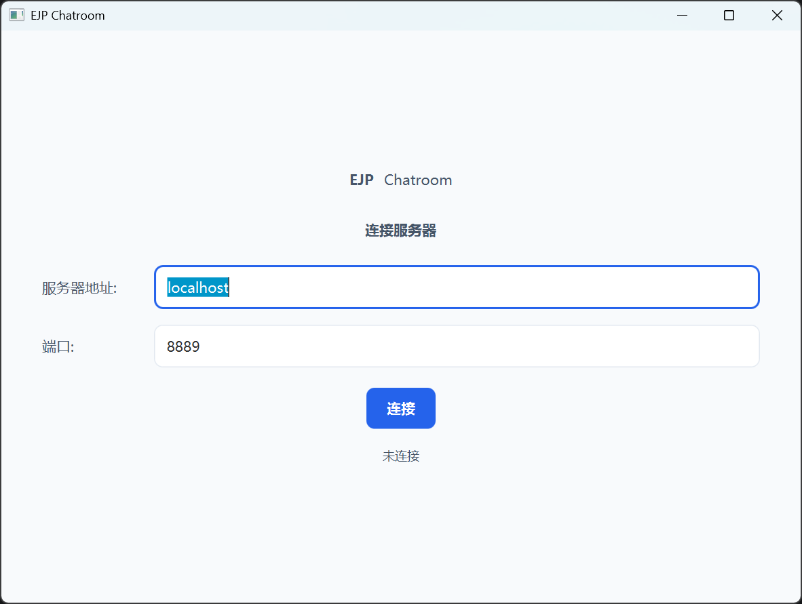
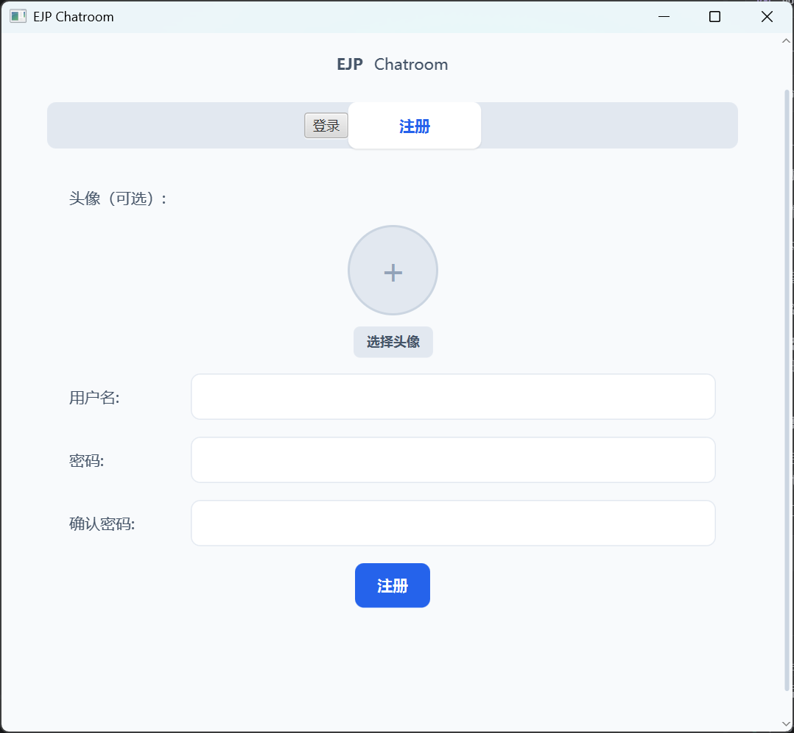
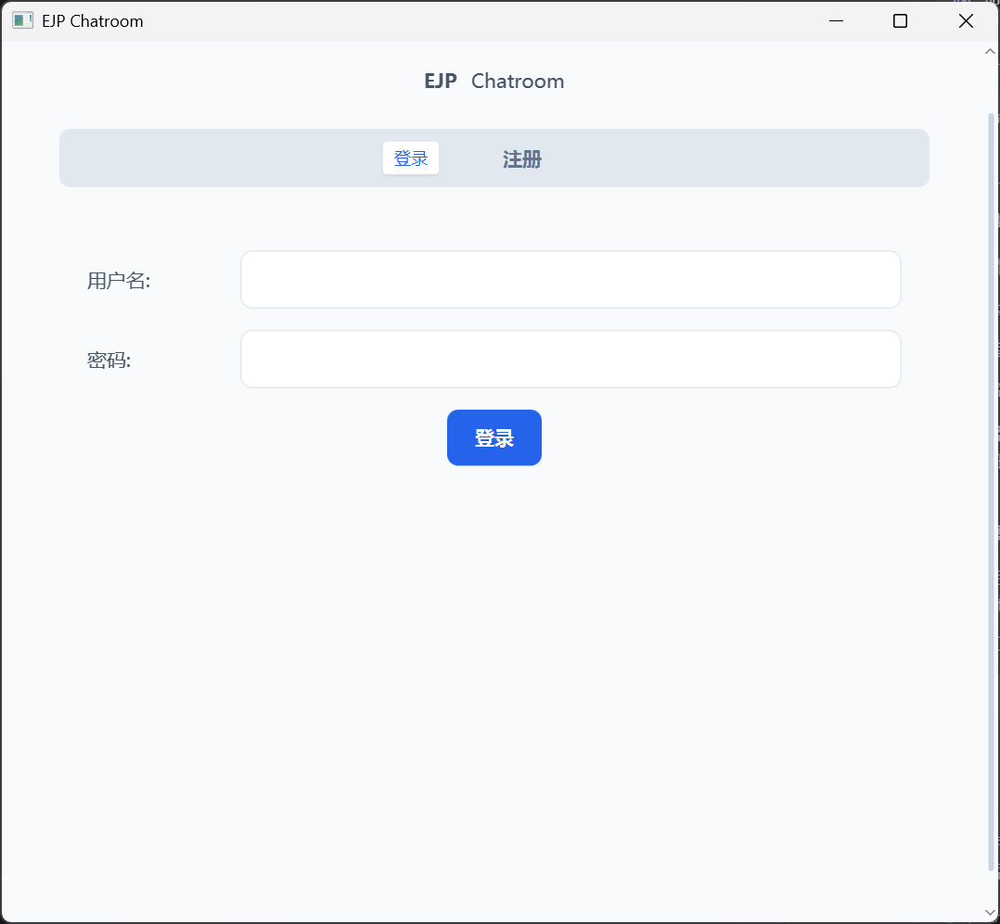
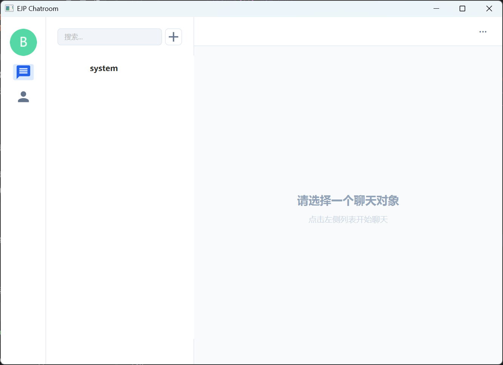

# EJP Chatroom 用户使用手册

## 目录

1. [概述](#1-概述)
2. [角色说明](#2-角色说明)
3. [普通用户功能](#3-普通用户功能)
4. [房间管理员功能](#4-房间管理员功能)
5. [主流程](#5-主流程)
6. [常见问题](#6-常见问题)

---

## 1. 概述

EJP Chatroom 是一个基于 WebSocket 的网络聊天室系统，支持实时消息、房间管理、好友系统等功能。本手册将详细介绍如何使用系统的各项功能。

### 系统要求

- **操作系统**: Windows 10+/Linux/macOS
- **Java版本**: JDK 21+（已打包在客户端中）

---

## 2. 角色说明

| 角色 | 权限说明 |
|------|----------|
| **普通用户** | 登录注册、发送消息、创建/加入房间、添加好友、查看个人资料、消息撤回、搜索聊天记录 |
| **房间成员** | 在房间内发送消息、查看房间公告、查看房间成员列表 |
| **房间管理员** | 设置房间公告、管理房间成员 |
| **房间房主** | 设置管理员、移除管理员、设置房间公告、管理成员 |

---

## 3. 普通用户功能

### 3.1 连接服务器



**操作步骤**:

1. 双击运行客户端应用程序
2. 在连接界面输入服务器地址（格式：`ws://服务器IP:8888`）
3. 点击"连接"按钮
4. 连接成功后进入登录界面

---

### 3.2 注册账号



**操作步骤**:

1. 在登录界面点击"注册"选项卡
2. （可选）点击圆形头像区域上传个人头像
3. 输入用户名、密码和确认密码
4. 点击"注册"按钮完成注册
5. 注册成功后自动跳转至登录界面

---

### 3.3 登录系统



**操作步骤**:

1. 在登录界面输入用户名和密码
2. 点击"登录"按钮
3. 登录成功后进入聊天主界面
4. 如果已有保存的登录信息，系统会自动填充

---

### 3.4 发送消息



**操作步骤**:

1. 在左侧列表中点击要聊天的对象（房间或好友）
2. 在底部输入框中输入消息内容
3. 点击"发送"按钮或按回车键发送消息

**快捷操作**:
- 点击"😊"按钮发送表情
- 点击"图片"按钮上传图片
- 点击"文件"按钮上传文件
- 点击"🎤"按钮发送语音

---

### 3.5 消息撤回

**操作步骤**:

1. 在聊天消息列表中右键点击已发送的消息
2. 在弹出菜单中选择"撤回"选项
3. 确认撤回操作
4. 消息将被标记为"已撤回"

> **注意**: 消息撤回有时间限制（2分钟），超过时间后无法撤回。

---

### 3.6 创建房间


**操作步骤**:

1. 点击左侧列表上方的"[+]"按钮
2. 在弹出菜单中选择"创建房间"
3. 输入房间名称
4. 选择房间类型（公共房间/私密房间）
5. 点击"创建"按钮
6. 创建成功后房间会出现在左侧列表中

---

### 3.7 加入房间

**操作步骤**:

1. 点击左侧列表上方的"[+]"按钮
2. 在弹出菜单中选择"加入房间"
3. 输入房间名称
4. 如果是公共房间，直接加入；如果是私密房间，等待房主/管理员批准
5. 加入成功后，房间会出现在左侧列表中

---

### 3.8 添加好友

**操作步骤**:

1. 点击左侧列表上方的"[+]"按钮
2. 在弹出菜单中选择"添加好友"
3. 输入好友用户名
4. 点击"发送请求"按钮
5. 等待对方接受好友请求
6. 好友接受后会出现在好友列表中

---

### 3.9 搜索

**操作步骤**:

1. 在左侧列表上方的搜索框中输入关键词
2. 系统会实时过滤匹配的房间或好友
3. 点击搜索结果即可开始聊天

---

### 3.10 搜索聊天记录


**操作步骤**:

1. 在聊天界面点击右上角的"···"按钮打开侧边栏
2. 在侧边栏顶部的搜索框中输入关键词
3. 系统会显示匹配的聊天记录
4. 点击搜索结果即可定位到该消息

---

### 3.11 查看个人资料


**操作步骤**:

1. 点击左上角的个人头像
2. 在弹出的个人资料窗口中查看信息
3. （可选）点击"更换头像"上传新头像
4. （可选）从下拉菜单中选择在线状态（在线/离线/离开/忙碌）
5. 点击"保存"按钮保存修改

---

### 3.12 查看房间成员


**操作步骤**:

1. 在聊天界面点击右上角的"···"按钮
2. 在弹出的侧边栏中查看房间成员列表
3. 在侧边栏顶部搜索框中可以搜索成员
4. 查看成员在线状态和角色

---

### 3.13 切换消息/联系人模式

**操作步骤**:

1. 点击左侧导航栏的消息图标（信封图标），切换到消息列表模式
2. 点击左侧导航栏的联系人图标（通讯录图标），切换到联系人列表模式
3. 在联系人模式下可以查看好友列表和在线状态

---

---

## 4. 房间管理员功能

### 4.1 设置房间公告

**操作步骤**:

1. 进入要管理的房间聊天界面
2. 点击右上角的"···"按钮打开侧边栏
3. 在侧边栏中找到"设置公告"选项
4. 输入公告内容
5. 点击"保存"按钮
6. 公告会显示在房间聊天界面顶部

---

### 4.2 设置房间管理员（房主专属）

**操作步骤**:

1. 进入要管理的房间聊天界面
2. 点击右上角的"···"按钮打开侧边栏
3. 在成员列表中找到要设置为管理员的用户
4. 点击用户旁边的"设置管理员"按钮
5. 确认操作
6. 用户角色变为管理员

---

### 4.3 移除房间管理员（房主专属）

**操作步骤**:

1. 进入要管理的房间聊天界面
2. 点击右上角的"···"按钮打开侧边栏
3. 在成员列表中找到要移除的管理员
4. 点击用户旁边的"移除管理员"按钮
5. 确认操作
6. 用户角色变为普通成员

---

### 4.4 处理房间加入请求

**操作步骤**:

1. 当有用户请求加入私密房间时，系统会发送通知
2. 点击通知查看请求详情
3. 选择"同意"或"拒绝"
4. 系统会将结果通知给请求用户

---

---

## 5. 主流程

### 5.1 首次使用流程

```
启动客户端 → 连接服务器 → 注册账号 → 登录系统 → 创建/加入房间 → 开始聊天
    │            │            │            │              │
    └────────────┴────────────┴────────────┴──────────────┘
                    ↓
            添加好友 → 私聊
```

**详细步骤**:

1. **启动客户端**
   - 双击运行客户端应用程序
   - 在连接界面输入服务器地址：`ws://服务器IP:8888`
   - 点击"连接"按钮

2. **注册账号**
   - 在登录界面点击"注册"选项卡
   - 输入用户名、密码、确认密码
   - （可选）上传头像
   - 点击"注册"按钮

3. **登录系统**
   - 在登录界面输入用户名和密码
   - 点击"登录"按钮
   - 登录成功后进入聊天主界面

4. **加入房间**
   - 点击左侧"[+]"按钮，选择"加入房间"
   - 输入房间名称（如"技术交流群"）
   - 点击"加入"按钮

5. **发送消息**
   - 在左侧列表中点击"技术交流群"
   - 在底部输入框中输入"大家好！"
   - 点击"发送"按钮

6. **添加好友**
   - 点击左侧"[+]"按钮，选择"添加好友"
   - 输入好友用户名（如"alice"）
   - 点击"发送请求"按钮

7. **私聊**
   - 等待好友接受请求后，好友会出现在左侧列表中
   - 点击好友名称进入私聊界面
   - 输入消息并发送

---

### 5.2 日常使用流程

```
启动客户端 → 连接服务器 → 登录系统 → 查看消息 → 回复消息 → 管理房间/好友
    │            │            │            │            │              │
    └────────────┴────────────┴────────────┴────────────┴──────────────┘
```

**详细步骤**:

1. **启动并连接**
   - 启动客户端，输入服务器地址并连接
   - 输入用户名和密码登录

2. **查看消息**
   - 登录后自动加载最近消息
   - 在左侧列表中查看有未读消息的聊天对象

3. **回复消息**
   - 点击有未读消息的聊天对象
   - 查看消息内容
   - 输入回复内容并发送

4. **管理操作**
   - 查看个人资料并更新状态
   - 创建新房间或加入其他房间
   - 添加新好友或处理好友请求

---

### 5.3 创建房间流程

```
点击[+] → 创建房间 → 输入名称 → 选择类型 → 创建成功 → 邀请好友
    │            │           │            │            │
    └────────────┴───────────┴────────────┴────────────┘
```

**详细步骤**:

1. 点击左侧列表上方的"[+]"按钮
2. 选择"创建房间"选项
3. 在弹出窗口中输入房间名称（如"项目讨论群"）
4. 选择房间类型：
   - **公共房间**：任何人都可以加入
   - **私密房间**：需要房主/管理员批准才能加入
5. 点击"创建"按钮
6. 创建成功后，房间会出现在左侧列表中
7. 可以通过添加好友或分享房间名称邀请他人加入

---

### 5.4 处理好友请求流程

**发送请求**:
```
点击[+] → 添加好友 → 输入用户名 → 发送请求 → 等待回复
    │            │           │            │            │
    └────────────┴───────────┴────────────┴────────────┘
```

**接收请求**:
```
收到通知 → 查看请求 → 同意/拒绝 → 结果通知对方
    │            │           │            │
    └────────────┴───────────┴────────────┘
```

---

## 6. 常见问题

### 6.1 无法连接服务器

**问题描述**: 启动客户端后无法连接到服务器

**解决方法**:

1. 检查服务器地址是否正确（格式：`ws://服务器IP:8888`）
2. 确认服务器是否已启动
3. 检查网络连接是否正常
4. 确认服务器防火墙是否开放了8888端口

### 6.2 登录失败

**问题描述**: 输入用户名和密码后登录失败

**解决方法**:

1. 检查用户名和密码是否正确
2. 如果忘记密码，请联系管理员重置
3. 如果是首次使用，请先注册账号

### 6.3 无法发送消息

**问题描述**: 输入消息后点击发送没有反应

**解决方法**:

1. 检查网络连接是否正常
2. 确认是否已选择聊天对象
3. 检查输入框是否为空

### 6.4 无法撤回消息

**问题描述**: 右键点击消息后没有"撤回"选项

**解决方法**:

1. 确认消息是自己发送的（只能撤回自己的消息）
2. 确认消息发送时间未超过2分钟
3. 检查网络连接是否正常

### 6.5 无法加入房间

**问题描述**: 尝试加入房间失败

**解决方法**:

1. 检查房间名称是否正确
2. 如果是私密房间，等待房主/管理员批准
3. 确认是否已经在房间中

### 6.6 好友请求没有回应

**问题描述**: 发送好友请求后对方没有回应

**解决方法**:

1. 确认对方用户名是否正确
2. 等待对方上线后查看请求
3. 如果长时间没有回应，可以重新发送请求

### 6.7 消息发送延迟

**问题描述**: 发送消息后需要很长时间才能显示

**解决方法**:

1. 检查网络连接质量
2. 确认服务器是否正常运行
3. 尝试重新连接服务器

### 6.8 无法上传文件/图片

**问题描述**: 点击上传文件或图片按钮后没有反应

**解决方法**:

1. 检查网络连接是否正常
2. 确认服务器是否配置了ZFile服务
3. 检查文件大小是否超限
4. 尝试上传其他文件

### 6.9 头像不显示

**问题描述**: 个人头像或好友头像不显示

**解决方法**:

1. 检查网络连接是否正常
2. 确认服务器是否配置了ZFile服务
3. 尝试重新上传头像
4. 如果没有上传头像，系统会显示默认头像（用户名首字母）

### 6.10 搜索聊天记录失败

**问题描述**: 在聊天记录搜索框中输入关键词后没有结果

**解决方法**:

1. 检查关键词是否正确
2. 确认该聊天对象是否有匹配的聊天记录
3. 尝试使用其他关键词搜索

---

## 7. 快捷键

| 快捷键 | 功能 |
|--------|------|
| Enter | 发送消息 |
| Ctrl + Enter | 换行 |
| Esc | 关闭弹窗/侧边栏 |

---

**文档版本**: v1.0  
**更新日期**: 2025-07-13