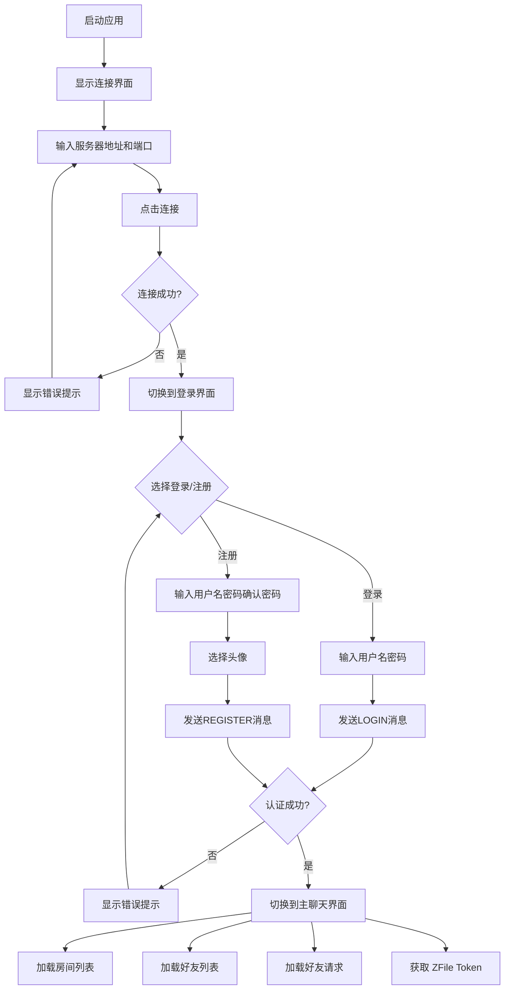
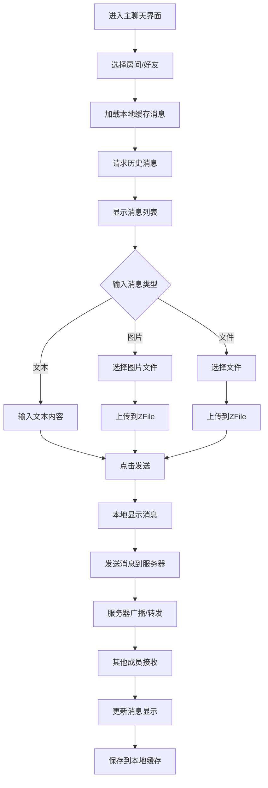
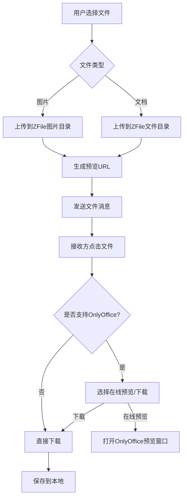
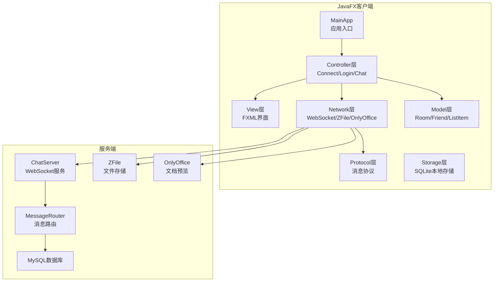

# EJP Chatroom 网络聊天室系统 - 产品需求文档

## 1. 产品概述

EJP Chatroom 是一套基于 WebSocket 的实时网络聊天室系统，包含 Java 后端服务器和 JavaFX 桌面客户端。系统提供现代化的图形用户界面，支持房间群聊、好友私聊、文件传输、图片分享、在线文档预览等核心功能，同时支持本地消息缓存，提升离线体验。

**目标用户**：需要进行团队协作、社交聊天的用户群体，偏好现代化界面的桌面用户，需要文件传输和文档预览功能的专业用户。

**市场价值**：提供跨平台、现代化的聊天体验，支持 Windows、macOS、Linux 等多种操作系统，集成文件管理和在线文档预览功能。

---

## 2. 核心功能

### 2.1 功能模块

| 模块名称 | 功能描述 | 归属 |
|----------|----------|------|
| 连接管理 | 服务器地址配置、端口配置、连接状态显示、WebSocket 连接 | 客户端 |
| 用户认证 | 登录、注册、密码验证、头像上传 | 服务器+客户端 |
| 房间管理 | 创建房间（public/private）、加入房间、离开房间、房间列表 | 服务器+客户端 |
| 消息系统 | 文本消息、图片消息、文件消息、系统消息、消息气泡样式 | 服务器+客户端 |
| 好友系统 | 添加好友、好友请求、好友列表、在线状态实时更新 | 服务器+客户端 |
| 文件处理 | 文件上传（ZFile）、文件下载、文件预览（OnlyOffice） | 服务器+客户端 |
| 本地存储 | SQLite 本地消息缓存、离线消息查看 | 客户端 |
| 界面交互 | 消息模式/通讯录模式切换、分类展开收起 | 客户端 |

### 2.2 页面/界面详情

| 界面名称 | FXML 文件 | 功能描述 | 控制器 |
|----------|-----------|----------|--------|
| 连接界面 | connect.fxml | 输入服务器地址和端口，建立 WebSocket 连接 | ConnectController |
| 登录界面 | login.fxml | 用户登录、注册、头像上传 | LoginController |
| 主聊天界面 | chat.fxml | 房间列表、好友列表、消息发送、文件上传 | ChatController |

### 2.3 详细功能说明

#### 2.3.1 连接管理

- **服务器配置**：输入服务器地址（默认 localhost）和端口（默认 8888）
- **连接状态**：显示未连接、连接中、已连接、连接失败四种状态
- **自动跳转**：连接成功后自动切换到登录界面

#### 2.3.2 用户认证

- **登录**：输入用户名和密码，发送 LOGIN 消息到服务器
- **注册**：输入用户名、密码、确认密码，支持上传头像（PNG/JPG/JPEG/GIF/BMP）
- **认证反馈**：显示登录/注册成功或失败信息
- **密码加密**：服务器端使用 BCrypt 加密存储密码

#### 2.3.3 房间管理

- **创建房间**：输入房间名称，选择房间类型（public/private）
- **加入房间**：输入房间名称加入
- **离开房间**：离开当前房间，返回系统房间
- **房间列表**：显示所有已加入的房间
- **房间公告**：支持设置房间公告信息

#### 2.3.4 消息系统

- **文本消息**：发送和接收纯文本消息
- **图片消息**：上传图片（最大 10MB），支持预览
- **文件消息**：上传文件（最大 50MB），支持下载和在线预览
- **系统消息**：显示系统通知
- **消息缓存**：本地 SQLite 存储历史消息

#### 2.3.5 好友系统

- **添加好友**：输入用户名发送好友请求
- **好友请求**：接收好友请求，同意/拒绝操作
- **好友列表**：显示所有好友及其在线状态
- **在线状态**：实时更新好友在线状态（ONLINE/OFFLINE/AWAY/BUSY）

#### 2.3.6 文件处理

- **ZFile 集成**：文件上传到 ZFile 服务器，支持图片和文件分类存储
- **OnlyOffice 预览**：支持文档（Word/Excel/PowerPoint/PDF 等）在线预览

---

## 3. 核心流程

### 3.1 用户登录流程



### 3.2 聊天流程



### 3.3 文件处理流程



---

## 4. 用户界面设计

### 4.1 设计风格

**整体风格**：现代简约，扁平化设计，圆角卡片风格

**配色方案**：

| 元素 | 颜色 | 十六进制 |
|------|------|----------|
| 主色调 | 深蓝色 | #2563eb |
| 主色调悬停 | 蓝色 | #3b82f6 |
| 背景色 | 浅灰 | #f8fafc |
| 卡片背景 | 白色 | #ffffff |
| 文字主色 | 深灰 | #1e293b |
| 文字次要 | 浅灰 | #64748b |
| 成功色 | 绿色 | #22c55e |
| 错误色 | 红色 | #ef4444 |
| 警告色 | 橙色 | #f97316 |
| 发送消息背景 | 深蓝色 | #2563eb |
| 接收消息背景 | 浅蓝灰 | #e2e8f0 |

**字体方案**：

| 元素 | 字体 | 大小 | 粗细 |
|------|------|------|------|
| 标题 | System | 18px | Bold |
| 消息内容 | System | 14px | Regular |
| 用户名 | System | 12px | Regular |
| 时间戳 | System | 10px | Regular |
| 按钮文本 | System | 14px | Medium |

**间距规范**：

| 元素 | 间距 |
|------|------|
| 卡片内边距 | 16px |
| 元素间距 | 12px |
| 列表项高度 | 48px |
| 圆角半径 | 12px |

### 4.2 界面设计详情

#### 连接界面

```
┌─────────────────────────────────────────────────┐
│                                                 │
│              ┌─────────────────────┐            │
│              │      Logo区域        │            │
│              │   EJP Chatroom      │            │
│              └─────────────────────┘            │
│                                                 │
│  ┌──────────────────────────────────────────┐   │
│  │           服务器配置                      │   │
│  │                                          │   │
│  │  ┌────────────────────────────────────┐  │   │
│  │  │ 服务器地址: [localhost             ] │  │   │
│  │  └────────────────────────────────────┘  │   │
│  │                                          │   │
│  │  ┌────────────────────────────────────┐  │   │
│  │  │ 端口:       [8888                 ] │  │   │
│  │  └────────────────────────────────────┘  │   │
│  │                                          │   │
│  │              [ 连接 ]                    │   │
│  └──────────────────────────────────────────┘   │
│                                                 │
│              连接状态: ○ 未连接                │
│                                                 │
└─────────────────────────────────────────────────┘
```

尺寸：450px × 400px

#### 登录界面

```
┌─────────────────────────────────────────────────┐
│                                                 │
│              ┌─────────────────────┐            │
│              │      Logo区域        │            │
│              │   EJP Chatroom      │            │
│              └─────────────────────┘            │
│                                                 │
│  ┌──────────────────────────────────────────┐   │
│  │           用户登录                        │   │
│  │                                          │   │
│  │  ┌────────────────────────────────────┐  │   │
│  │  │ 用户名: [________________________] │  │   │
│  │  └────────────────────────────────────┘  │   │
│  │                                          │   │
│  │  ┌────────────────────────────────────┐  │   │
│  │  │ 密码:   [________________________] │  │   │
│  │  └────────────────────────────────────┘  │   │
│  │                                          │   │
│  │              [ 登录 ]                     │   │
│  └──────────────────────────────────────────┘   │
│                                                 │
│  ┌──────────────────────────────────────────┐   │
│  │           用户注册                        │   │
│  │                                          │   │
│  │  ┌────────────────────────────────────┐  │   │
│  │  │ 用户名: [________________________] │  │   │
│  │  └────────────────────────────────────┘  │   │
│  │                                          │   │
│  │  ┌────────────────────────────────────┐  │   │
│  │  │ 密码:   [________________________] │  │   │
│  │  └────────────────────────────────────┘  │   │
│  │                                          │   │
│  │  ┌────────────────────────────────────┐  │   │
│  │  │ 确认密码: [________________________] │  │   │
│  │  └────────────────────────────────────┘  │   │
│  │                                          │   │
│  │  ┌──────┐            [ 选择头像 ]        │   │
│  │  │ ○    │                               │   │
│  │  └──────┘            [ 注册 ]            │   │
│  └──────────────────────────────────────────┘   │
│                                                 │
│              状态: 未连接                     │
│                                                 │
└─────────────────────────────────────────────────┘
```

尺寸：450px × 400px

#### 主聊天界面

```
┌───────────────────────────────────────────────────────────────┐
│  ┌───────────────────────────────┐  ┌──────────────────────┐  │
│  │ [消息]  [通讯录]               │  │ 当前聊天: system     │  │
│  └───────────────────────────────┘  └──────────────────────┘  │
│  ┌───────────────────────────────┐  ┌──────────────────────┐  │
│  │                               │  │                      │  │
│  │  ● Room 1                     │  │  系统消息区域         │  │
│  │  ● Room 2                     │  │                      │  │
│  │  ● user1 (在线)               │  │  用户消息气泡         │  │
│  │  ○ user2 (离线)               │  │                      │  │
│  │                               │  │                      │  │
│  │                               │  │                      │  │
│  │                               │  │                      │  │
│  │                               │  │                      │  │
│  │                               │  │                      │  │
│  │                               │  └──────────────────────┘  │
│  │                               │  ┌──────────────────────┐  │
│  │                               │  │ [输入消息...] [发送]  │  │
│  │                               │  │ [📷] [📁]             │  │
│  │                               │  └──────────────────────┘  │
│  └───────────────────────────────┘  └──────────────────────┘  │
│  ┌──────────────────────────────────────────────────────────┐  │
│  │ [创建房间] [加入房间] [离开房间] [添加好友] [好友请求]    │  │
│  └──────────────────────────────────────────────────────────┘  │
└───────────────────────────────────────────────────────────────┘
```

尺寸：900px × 650px

### 4.3 消息气泡设计

#### 发送消息气泡

```
┌──────────────────────────────────────┐
│  我 [2026-07-08 10:00:00]            │
│  ┌────────────────────────────────┐  │
│  │  Hello World!                  │  │
│  │                                │  │
│  │  This is a longer message      │  │
│  │  that spans multiple lines.    │  │
│  └────────────────────────────────┘  │
│                                      │
│  ┌────────────────────────────────┐  │
│  │  [📷 图片预览]                 │  │
│  └────────────────────────────────┘  │
│                                      │
│  ┌────────────────────────────────┐  │
│  │  [📁 document.pdf]             │  │
│  └────────────────────────────────┘  │
└──────────────────────────────────────┘
```

样式：右对齐，深蓝色背景（#2563eb），白色文字，圆角 12px

#### 接收消息气泡

```
┌──────────────────────────────────────┐
│  user1 [2026-07-08 10:01:00]         │
│  ┌────────────────────────────────┐  │
│  │  Hi there!                     │  │
│  └────────────────────────────────┘  │
└──────────────────────────────────────┘
```

样式：左对齐，浅蓝灰背景（#e2e8f0），深灰文字，圆角 12px

### 4.4 列表项设计

#### 房间列表项

```
┌─────────────────────────────────────┐
│  ● Room 1                           │
│  ● Room 2                           │
│  ● Room 3                           │
└─────────────────────────────────────┘
```

#### 好友列表项

```
┌─────────────────────────────────────┐
│  ● user1 (在线)                     │
│  ○ user2 (离线)                     │
│  ● user3 (在线)                     │
└─────────────────────────────────────┘
```

在线状态：绿色圆点（●），离线状态：灰色圆点（○）

---

## 5. 技术架构

### 5.1 系统架构图



### 5.2 技术栈

| 层级 | 技术 | 版本 |
|------|------|------|
| 框架 | JavaFX | 21 |
| 语言 | Java | 21 |
| WebSocket | Java-WebSocket | 1.5.7 |
| JSON处理 | Gson | 2.13.2 |
| 构建工具 | Maven | 3.8+ |
| 本地存储 | SQLite | 3.42.0 |
| 数据库 | MySQL | 8.0+ |
| 文件服务 | ZFile API | - |
| 文档预览 | OnlyOffice | - |
| 密码加密 | BCrypt | 0.10.2 |

### 5.3 项目结构

#### 服务器端

```
server/
├── ChatServer.java                    # 服务器主入口
├── compile.sh                         # 编译脚本
├── run.sh                             # 运行脚本
├── config/
│   └── service.properties             # 服务配置（SSL、ZFile）
├── sql/
│   ├── DatabaseManager.java           # 数据库管理器
│   ├── database.properties            # 数据库连接配置
│   ├── user/                          # 用户数据访问
│   ├── friend/                        # 好友关系数据访问
│   ├── room/                          # 房间数据访问
│   ├── message/                       # 消息数据访问
│   └── conversation/                  # 会话数据访问
├── network/                           # 网络层（WebSocket）
├── user/                              # 用户业务逻辑
├── room/                              # 房间业务逻辑
├── message/                           # 消息处理逻辑
├── zfile/                             # ZFile 文件服务集成
├── util/                              # 工具类
├── lib/                               # 第三方依赖
└── log/                               # 日志文件
```

#### JavaFX 客户端

```
client/javafx/
├── pom.xml
└── src/main/
    ├── java/
    │   └── client/javafx/
    │       ├── Main.java                    # 启动器
    │       ├── MainApp.java                 # 应用入口，界面切换
    │       ├── controller/                  # 控制器层
    │       │   ├── ConnectController.java   # 连接界面控制器
    │       │   ├── LoginController.java     # 登录界面控制器
    │       │   ├── ChatController.java      # 主聊天界面控制器
    │       │   └── ProfileController.java   # 个人资料控制器
    │       ├── network/                     # 网络层
    │       │   ├── ChatWebSocketClient.java # WebSocket客户端
    │       │   ├── ZFileService.java        # 文件上传下载服务
    │       │   └── OnlyOfficeService.java   # 在线文档预览服务
    │       ├── protocol/                    # 协议层
    │       │   ├── ChatMessage.java         # 消息实体
    │       │   └── MessageType.java         # 消息类型枚举
    │       ├── model/                       # 数据模型
    │       │   ├── Room.java                # 房间模型
    │       │   └── Friend.java              # 好友模型
    │       ├── storage/                     # 存储层
    │       │   └── LocalMessageStorage.java # SQLite本地消息存储
    │       └── util/                        # 工具类
    │           ├── Logger.java              # 日志工具
    │           └── PlatformUtils.java       # 跨平台路径工具
    └── resources/
        ├── client/javafx/
        │   ├── connect.fxml                 # 连接界面
        │   ├── login.fxml                   # 登录界面
        │   ├── chat.fxml                    # 聊天界面
        │   └── profile.fxml                 # 个人资料界面
        └── styles/
            └── main.css                     # 全局样式
```

### 5.4 消息协议

#### 消息类型枚举

| 消息类型 | 说明 |
|----------|------|
| LOGIN | 用户登录请求 |
| REGISTER | 用户注册请求 |
| AUTH_SUCCESS | 认证成功响应 |
| AUTH_FAILURE | 认证失败响应 |
| TEXT | 文本消息 |
| PRIVATE_CHAT | 私聊消息 |
| IMAGE | 图片消息 |
| FILE | 文件消息 |
| SYSTEM | 系统消息 |
| JOIN | 加入房间 |
| CREATE_ROOM | 创建房间 |
| EXIT_ROOM | 离开房间 |
| ROOM_LIST | 房间列表 |
| FRIEND_LIST | 好友列表 |
| FRIEND_REQUEST | 好友请求 |
| FRIEND_REQUEST_RESPONSE | 好友请求响应 |
| ALL_FRIEND_REQUESTS | 所有好友请求 |
| USER_STATUS_UPDATE | 用户状态更新 |
| REQUEST_TOKEN | 请求上传Token |
| TOKEN_RESPONSE | Token响应 |
| SERVICE_CONFIG | 服务配置 |
| REQUEST_HISTORY | 请求历史消息 |
| HISTORY_RESPONSE | 历史消息响应 |

#### 消息数据结构

```java
public class ChatMessage {
    String type;           // 消息类型
    String from;           // 发送者
    String content;        // 消息内容
    String time;           // 时间戳
    String id;             // 消息ID
    Integer conversationId;// 会话ID
    boolean isNSFW;        // 是否敏感内容
    String iv;             // 加密向量
}
```

### 5.5 数据库设计

#### 服务器端数据库表

**user 表**：

| 字段名 | 类型 | 说明 |
|--------|------|------|
| id | INT | 主键，自增 |
| username | VARCHAR(50) | 用户名，唯一 |
| password | VARCHAR(255) | BCrypt加密密码 |
| avatar | VARCHAR(255) | 头像路径 |
| created_at | TIMESTAMP | 创建时间 |
| accept_temporary_chat | BOOLEAN | 是否接受临时聊天 |
| status | VARCHAR(20) | 在线状态 |
| last_logout_time | TIMESTAMP | 最后下线时间 |

**room 表**：

| 字段名 | 类型 | 说明 |
|--------|------|------|
| id | INT | 主键，自增 |
| room_name | VARCHAR(100) | 房间名称，唯一 |
| room_type | VARCHAR(20) | 房间类型（PUBLIC/PRIVATE） |
| created_at | TIMESTAMP | 创建时间 |
| announcement | TEXT | 房间公告 |

**messages 表**：

| 字段名 | 类型 | 说明 |
|--------|------|------|
| id | INT | 主键，自增 |
| type | VARCHAR(20) | 消息类型 |
| user_id | INT | 发送者ID |
| conversation_id | INT | 会话ID |
| content | TEXT | 消息内容 |
| create_time | TIMESTAMP | 创建时间 |
| message_type | VARCHAR(20) | 消息类别 |
| is_nsfw | BOOLEAN | 是否敏感内容 |
| iv | VARCHAR(255) | 加密向量 |

#### 客户端本地存储

**messages 表**：

| 字段名 | 类型 | 说明 |
|--------|------|------|
| id | INTEGER | 主键，自增 |
| conversation_id | INTEGER | 会话ID |
| conversation_name | TEXT | 会话名称 |
| message_type | TEXT | 消息类型 |
| from_user | TEXT | 发送者 |
| content | TEXT | 消息内容 |
| time | TEXT | 时间戳 |
| message_id | TEXT | 消息唯一ID（唯一约束） |
| is_nsfw | INTEGER | 是否敏感内容 |
| iv | TEXT | 加密向量 |

**存储路径**：

```
~/.chat_client/{username}_messages.db
```

---

## 6. 部署与运行

### 6.1 环境要求

- Java 21+
- Maven 3.8+（仅 JavaFX 客户端）
- MySQL 8.0+

### 6.2 服务器端运行

```bash
cd server

# 编译
chmod +x compile.sh
./compile.sh

# 运行（默认端口 8888）
chmod +x run.sh
./run.sh
```

### 6.3 客户端编译运行

```bash
cd client/javafx
mvn clean compile
mvn javafx:run
```

### 6.4 客户端打包发布

```bash
cd client/javafx
mvn clean package -DskipTests

# 生成平台特定的应用镜像
# Linux: target/jpackage/linux/chatroom-client/
# Windows: target/jpackage/windows/chatroom-client/（需在Windows环境构建）
# macOS: target/jpackage/mac/chatroom-client/（需在macOS环境构建）

# 运行生成的应用
java -jar target/chatroom-javafx-1.0.0.jar
```

---

## 7. 性能要求

### 7.1 响应时间

| 指标 | 要求 |
|------|------|
| 界面加载时间 | < 500ms |
| 消息发送延迟 | < 100ms |
| 列表刷新时间 | < 300ms |
| 文件上传进度更新 | 实时 |

### 7.2 内存占用

| 指标 | 要求 |
|------|------|
| 启动内存 | < 100MB |
| 运行内存 | < 200MB |

### 7.3 文件大小限制

| 文件类型 | 最大限制 |
|----------|----------|
| 图片文件 | 10MB |
| 普通文件 | 50MB |

---

## 8. 非功能需求

### 8.1 安全性

- WebSocket 连接支持 SSL/TLS 加密
- 密码使用 BCrypt 加密存储
- 本地消息存储使用 SQLite
- 文件上传使用 Token 认证

### 8.2 可用性

- 支持离线查看本地缓存消息
- 连接断开后自动尝试重连
- 友好的错误提示信息

### 8.3 兼容性

- 支持 Windows 10+
- 支持 macOS 10.15+
- 支持 Linux（Ubuntu 18.04+）

---

## 9. 版本历史

| 版本 | 日期 | 变更内容 |
|------|------|----------|
| v1.0 | 2026-07-05 | 初始版本，基于 JavaFX 实现聊天客户端 |
| v1.1 | 2026-07-08 | 添加连接界面、头像上传、文件传输、OnlyOffice预览、本地消息缓存 |
| v1.2 | 2026-07-13 | 完善服务器端架构，添加会话系统、跨平台打包支持 |

---

## 10. 附录

### 10.1 支持的文档预览格式

| 格式类别 | 扩展名 |
|----------|--------|
| Word | .doc, .docx, .docm, .dot, .dotx, .dotm, .odt, .fodt |
| Excel | .xls, .xlsx, .xlsm, .xlt, .xltx, .xltm, .ods, .fods |
| PowerPoint | .ppt, .pptx, .pptm, .pps, .ppsx, .ppsm, .odp, .fodp |
| PDF | .pdf |
| 其他 | .epub, .djvu, .xps, .oxps |

### 10.2 支持的头像格式

- PNG (.png)
- JPG/JPEG (.jpg, .jpeg)
- GIF (.gif)
- BMP (.bmp)

### 10.3 默认配置

| 配置项 | 默认值 |
|--------|--------|
| 服务器地址 | localhost |
| 服务器端口 | 8888 |
| 最小窗口宽度 | 800px |
| 最小窗口高度 | 600px |
| 消息气泡最大宽度 | 300px |
| 图片预览最大尺寸 | 200px × 200px |