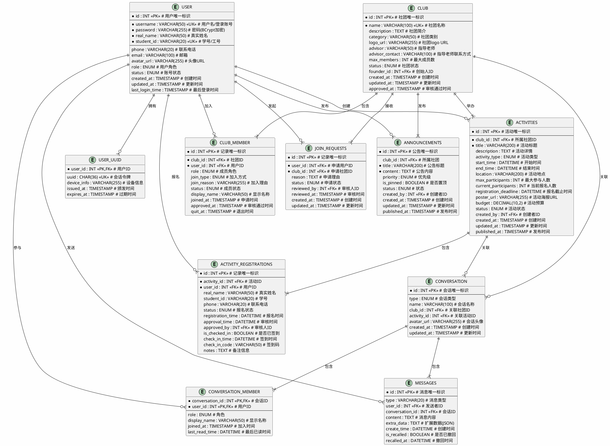
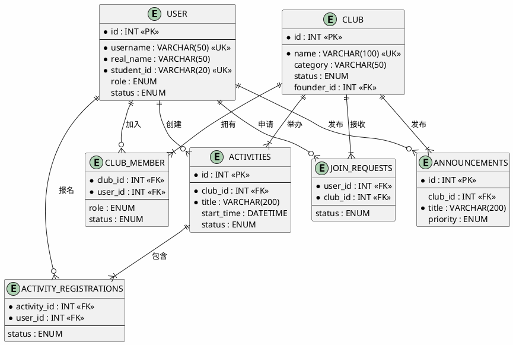

# 学生社团管理系统 - 概念结构设计（ER图）

---

## 1. 实体关系图

### 1.1 完整ER图



### 1.2 简化ER图（重点展示核心实体关系）



---

## 2. 实体详细说明

### 2.1 用户实体 (USER)

| 属性 | 类型 | 说明 | 约束 |
| :--- | :--- | :--- | :--- |
| id | INT | 用户唯一标识 | 主键，自增 |
| username | VARCHAR(50) | 用户名/登录账号 | 非空，唯一 |
| password | VARCHAR(255) | 密码（BCrypt加密） | 非空 |
| real_name | VARCHAR(50) | 真实姓名 | 可空 |
| student_id | VARCHAR(20) | 学号/工号 | 可空，唯一 |
| phone | VARCHAR(20) | 联系电话 | 可空 |
| email | VARCHAR(100) | 邮箱 | 可空 |
| avatar_url | VARCHAR(255) | 头像URL | 可空 |
| role | ENUM | 用户角色 | 非空，默认STUDENT |
| status | ENUM | 账号状态 | 非空，默认ACTIVE |
| created_at | TIMESTAMP | 创建时间 | 默认当前时间 |
| updated_at | TIMESTAMP | 更新时间 | 更新时自动设置 |
| last_login_time | TIMESTAMP | 最后登录时间 | 可空 |

**角色枚举值**：
- STUDENT：学生
- ADMIN：社团管理员
- SUPER_ADMIN：系统管理员

**状态枚举值**：
- ACTIVE：正常
- INACTIVE：未激活
- SUSPENDED：已封禁

### 2.2 社团实体 (CLUB)

| 属性 | 类型 | 说明 | 约束 |
| :--- | :--- | :--- | :--- |
| id | INT | 社团唯一标识 | 主键，自增 |
| name | VARCHAR(100) | 社团名称 | 非空，唯一 |
| description | TEXT | 社团简介 | 可空 |
| category | VARCHAR(50) | 社团类别 | 可空 |
| logo_url | VARCHAR(255) | 社团logo URL | 可空 |
| advisor | VARCHAR(50) | 指导老师 | 可空 |
| advisor_contact | VARCHAR(100) | 指导老师联系方式 | 可空 |
| max_members | INT | 最大成员数 | 默认100 |
| status | ENUM | 社团状态 | 非空，默认PENDING |
| founder_id | INT | 创始人ID | 外键，可空 |
| created_at | TIMESTAMP | 创建时间 | 默认当前时间 |
| updated_at | TIMESTAMP | 更新时间 | 更新时自动设置 |
| approved_at | TIMESTAMP | 审核通过时间 | 可空 |

**状态枚举值**：
- PENDING：待审核
- APPROVED：已通过
- REJECTED：已拒绝
- SUSPENDED：已停用

### 2.3 社团成员实体 (CLUB_MEMBER)

| 属性 | 类型 | 说明 | 约束 |
| :--- | :--- | :--- | :--- |
| id | INT | 记录唯一标识 | 主键，自增 |
| club_id | INT | 社团ID | 外键，非空 |
| user_id | INT | 用户ID | 外键，非空 |
| role | ENUM | 成员角色 | 非空，默认MEMBER |
| join_type | ENUM | 加入方式 | 非空，默认APPLY |
| join_reason | VARCHAR(255) | 加入理由 | 可空 |
| status | ENUM | 成员状态 | 非空，默认PENDING |
| display_name | VARCHAR(50) | 显示名称 | 可空 |
| joined_at | TIMESTAMP | 申请时间 | 默认当前时间 |
| approved_at | TIMESTAMP | 审核通过时间 | 可空 |
| quit_at | TIMESTAMP | 退出时间 | 可空 |

**角色枚举值**：
- PRESIDENT：社长
- VICE_PRESIDENT：副社长
- ADMIN：管理员
- MEMBER：普通成员

**加入方式枚举值**：
- APPLY：申请加入
- INVITE：邀请加入

**状态枚举值**：
- PENDING：待审核
- APPROVED：已通过
- REJECTED：已拒绝
- QUIT：已退出
- EXPELLED：已开除

### 2.4 活动实体 (ACTIVITIES)

| 属性 | 类型 | 说明 | 约束 |
| :--- | :--- | :--- | :--- |
| id | INT | 活动唯一标识 | 主键，自增 |
| club_id | INT | 所属社团ID | 外键，非空 |
| title | VARCHAR(200) | 活动标题 | 非空 |
| description | TEXT | 活动详情 | 可空 |
| activity_type | ENUM | 活动类型 | 非空，默认INTERNAL |
| start_time | DATETIME | 开始时间 | 非空 |
| end_time | DATETIME | 结束时间 | 非空 |
| location | VARCHAR(200) | 活动地点 | 可空 |
| max_participants | INT | 最大参与人数 | 默认0（不限） |
| current_participants | INT | 当前报名人数 | 默认0 |
| registration_deadline | DATETIME | 报名截止时间 | 可空 |
| poster_url | VARCHAR(255) | 活动海报URL | 可空 |
| budget | DECIMAL(10,2) | 活动预算 | 默认0.00 |
| status | ENUM | 活动状态 | 非空，默认DRAFT |
| created_by | INT | 创建者ID | 外键，非空 |
| created_at | TIMESTAMP | 创建时间 | 默认当前时间 |
| updated_at | TIMESTAMP | 更新时间 | 更新时自动设置 |
| published_at | TIMESTAMP | 发布时间 | 可空 |

**活动类型枚举值**：
- INTERNAL：内部活动
- CLUB_ONLY：仅限社团成员
- PUBLIC：公开活动
- COMPETITION：竞赛活动
- TRAINING：培训活动

**状态枚举值**：
- DRAFT：草稿
- PUBLISHED：已发布
- IN_PROGRESS：进行中
- COMPLETED：已完成
- CANCELLED：已取消

### 2.5 公告实体 (ANNOUNCEMENTS)

| 属性 | 类型 | 说明 | 约束 |
| :--- | :--- | :--- | :--- |
| id | INT | 公告唯一标识 | 主键，自增 |
| club_id | INT | 所属社团 | 外键，可空（系统公告） |
| title | VARCHAR(200) | 公告标题 | 非空 |
| content | TEXT | 公告内容 | 非空 |
| priority | ENUM | 优先级 | 非空，默认NORMAL |
| is_pinned | BOOLEAN | 是否置顶 | 默认FALSE |
| status | ENUM | 状态 | 非空，默认DRAFT |
| created_by | INT | 创建者ID | 外键，非空 |
| created_at | TIMESTAMP | 创建时间 | 默认当前时间 |
| updated_at | TIMESTAMP | 更新时间 | 更新时自动设置 |
| published_at | TIMESTAMP | 发布时间 | 可空 |

**优先级枚举值**：
- NORMAL：普通
- IMPORTANT：重要
- URGENT：紧急

**状态枚举值**：
- DRAFT：草稿
- PUBLISHED：已发布
- ARCHIVED：已归档

---

## 3. 关系说明

### 3.1 关系矩阵

| 关系 | 实体1 | 实体2 | 基数 | 说明 |
| :--- | :--- | :--- | :--- | :--- |
| 创建 | USER | CLUB | 1:N | 一个用户可以创建多个社团 |
| 加入 | USER | CLUB_MEMBER | 1:N | 一个用户可以加入多个社团 |
| 包含 | CLUB | CLUB_MEMBER | 1:N | 一个社团有多个成员 |
| 发起 | USER | JOIN_REQUESTS | 1:N | 一个用户可以发起多个入社申请 |
| 接收 | CLUB | JOIN_REQUESTS | 1:N | 一个社团可以接收多个入社申请 |
| 创建 | USER | ACTIVITIES | 1:N | 一个用户可以创建多个活动 |
| 举办 | CLUB | ACTIVITIES | 1:N | 一个社团可以举办多个活动 |
| 报名 | USER | ACTIVITY_REGISTRATIONS | 1:N | 一个用户可以报名多个活动 |
| 包含 | ACTIVITIES | ACTIVITY_REGISTRATIONS | 1:N | 一个活动有多个报名记录 |
| 发布 | USER | ANNOUNCEMENTS | 1:N | 一个用户可以发布多个公告 |
| 发布 | CLUB | ANNOUNCEMENTS | 1:N | 一个社团可以发布多个公告 |
| 关联 | CLUB | CONVERSATION | 1:1 | 一个社团关联一个群聊会话 |
| 关联 | ACTIVITIES | CONVERSATION | 1:1 | 一个活动关联一个讨论会话 |
| 参与 | USER | CONVERSATION_MEMBER | 1:N | 一个用户可以参与多个会话 |
| 包含 | CONVERSATION | CONVERSATION_MEMBER | 1:N | 一个会话有多个成员 |
| 发送 | USER | MESSAGES | 1:N | 一个用户可以发送多条消息 |
| 包含 | CONVERSATION | MESSAGES | 1:N | 一个会话包含多条消息 |
| 拥有 | USER | USER_UUID | 1:1 | 一个用户拥有一个会话令牌 |

### 3.2 关系约束说明

1. **用户与社团的关系**：
   - 用户可以创建多个社团（1:N）
   - 用户可以加入多个社团（1:N）
   - 社团必须有一个创始人

2. **社团与成员的关系**：
   - 社团与成员是一对多关系
   - 一个用户在一个社团中只能有一条记录（唯一约束）

3. **活动与报名的关系**：
   - 活动与报名是一对多关系
   - 一个用户在一个活动中只能报名一次（唯一约束）

4. **公告的特殊关系**：
   - club_id为NULL表示系统公告
   - club_id非NULL表示社团公告

5. **会话与社团/活动的关系**：
   - 社团群聊：type='CLUB'，关联club_id
   - 活动讨论：type='ACTIVITY'，关联activity_id
   - 私聊：type='PRIVATE'，不关联其他实体

---

## 4. 概念模型特点

### 4.1 继承关系

系统中存在以下继承关系：
- **用户角色继承**：STUDENT → ADMIN → SUPER_ADMIN，权限逐级递增
- **社团成员角色继承**：MEMBER → ADMIN → VICE_PRESIDENT → PRESIDENT，权限逐级递增

### 4.2 状态机

多个实体具有状态转换逻辑：

**用户状态机**：
```
ACTIVE ↔ INACTIVE ↔ SUSPENDED
```

**社团状态机**：
```
PENDING → APPROVED → SUSPENDED
  ↓
REJECTED
```

**活动状态机**：
```
DRAFT → PUBLISHED → IN_PROGRESS → COMPLETED
            ↓
        CANCELLED
```

**报名状态机**：
```
PENDING → APPROVED
   ↓
REJECTED
```

### 4.3 业务规则

| 规则编号 | 规则描述 | 涉及实体 |
| :--- | :--- | :--- |
| BR-001 | 学号/工号必须唯一 | USER |
| BR-002 | 社团名称必须唯一 | CLUB |
| BR-003 | 用户不能重复加入同一社团 | CLUB_MEMBER |
| BR-004 | 用户不能重复报名同一活动 | ACTIVITY_REGISTRATIONS |
| BR-005 | 报名人数不能超过活动最大限制 | ACTIVITIES, ACTIVITY_REGISTRATIONS |
| BR-006 | 入社申请审核通过后自动成为社团成员 | JOIN_REQUESTS, CLUB_MEMBER |
| BR-007 | 社团创建后自动创建群聊会话 | CLUB, CONVERSATION |

---

*文档版本：1.0*  
*创建日期：2026年6月*  
*适用系统：学生社团管理系统 (stuclub)