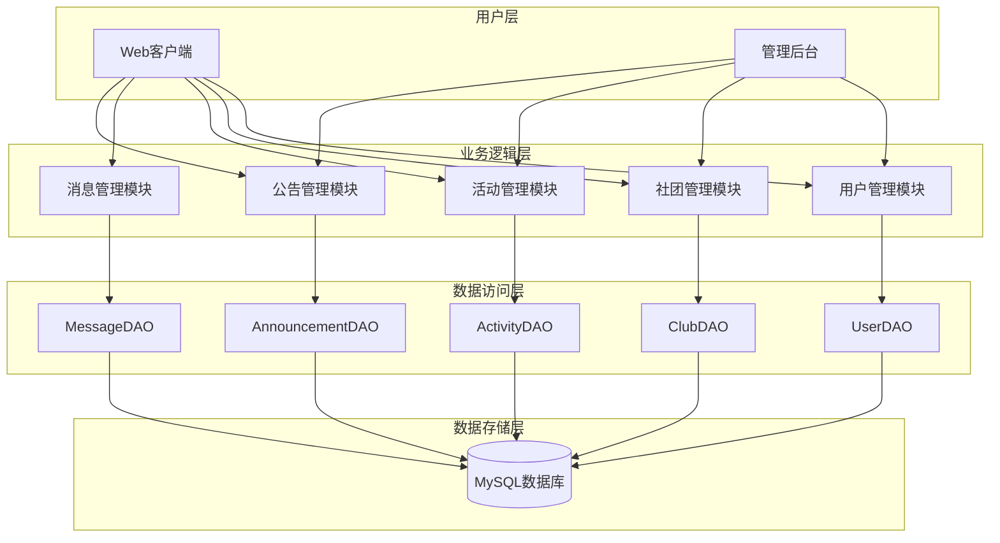
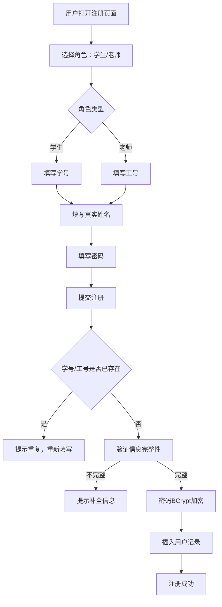
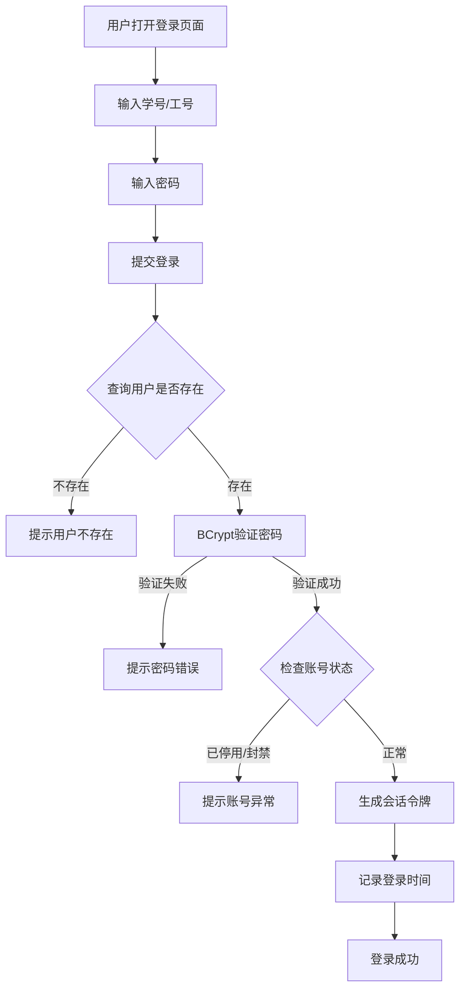
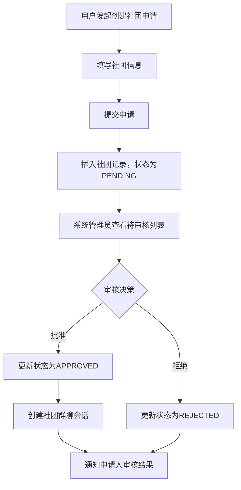
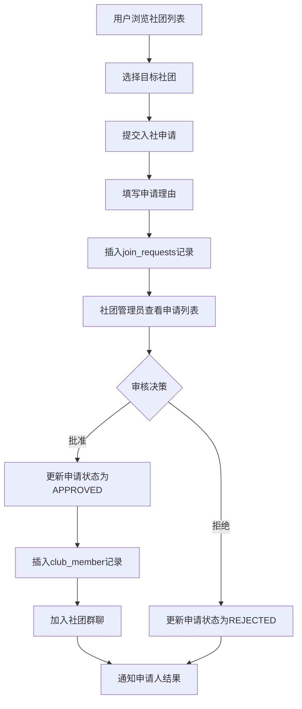
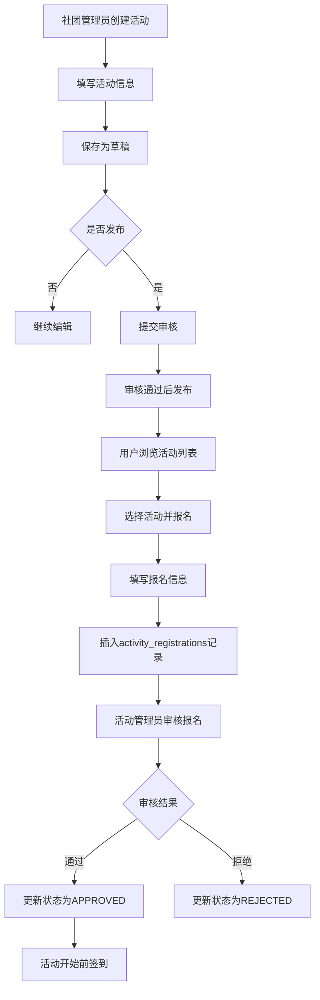
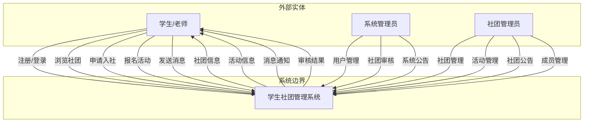
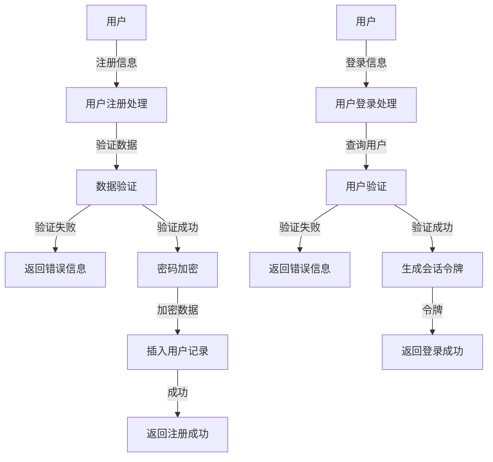

# 学生社团管理系统 - 需求分析文档

---

## 1. 系统概述

学生社团管理系统（Student Club Management System）是一个面向高校学生和社团的综合性管理平台，旨在解决传统社团管理方式效率低下、信息分散等问题。系统提供用户管理、社团管理、活动管理、消息通信、公告发布等核心功能，支持学生社团的规范化、信息化管理。

---

## 2. 需求分析文字描述

### 2.1 功能需求

#### 2.1.1 用户管理模块

| 需求编号 | 需求描述 | 优先级 |
| :--- | :--- | :--- |
| UR-001 | 用户注册：学生/老师需提供真实姓名、角色、学号/工号（必填且唯一）、密码等信息 | 高 |
| UR-002 | 用户登录：使用学号/工号和密码进行身份验证 | 高 |
| UR-003 | 用户信息管理：支持查看、修改个人信息（头像、联系方式等） | 中 |
| UR-004 | 用户角色管理：支持学生、社团管理员、系统管理员三种角色 | 高 |
| UR-005 | 用户状态管理：支持激活、停用、封禁等状态控制 | 高 |

#### 2.1.2 社团管理模块

| 需求编号 | 需求描述 | 优先级 |
| :--- | :--- | :--- |
| CR-001 | 社团创建：用户可申请创建新社团，需填写名称、简介、类别、指导老师等信息 | 高 |
| CR-002 | 社团审核：系统管理员审核社团创建申请，支持通过/拒绝操作 | 高 |
| CR-003 | 社团查询：支持按名称、类别、状态搜索社团 | 高 |
| CR-004 | 社团成员管理：社长可管理成员，包括批准入社申请、设置角色、移除成员 | 高 |
| CR-005 | 入社申请：用户可申请加入社团，需填写申请理由 | 高 |
| CR-006 | 社团信息编辑：社长可修改社团基本信息 | 中 |
| CR-007 | 社团状态管理：支持待审核、已通过、已拒绝、已停用等状态 | 高 |

#### 2.1.3 活动管理模块

| 需求编号 | 需求描述 | 优先级 |
| :--- | :--- | :--- |
| AR-001 | 活动创建：社团管理员可创建活动，填写标题、详情、时间、地点、预算等信息 | 高 |
| AR-002 | 活动发布：活动需经过审核后发布 | 高 |
| AR-003 | 活动报名：用户可报名参加活动，支持审核机制 | 高 |
| AR-004 | 活动签到：活动现场支持签到功能，生成签到码 | 高 |
| AR-005 | 活动状态管理：支持草稿、已发布、进行中、已完成、已取消等状态 | 高 |
| AR-006 | 活动查询：支持按名称、社团、时间搜索活动 | 中 |

#### 2.1.4 消息管理模块

| 需求编号 | 需求描述 | 优先级 |
| :--- | :--- | :--- |
| MR-001 | 社团群聊：每个社团自动创建群聊，成员可发送消息 | 高 |
| MR-002 | 私聊功能：用户之间可进行一对一私密聊天 | 高 |
| MR-003 | 消息存储：消息持久化存储，支持历史记录查询 | 高 |
| MR-004 | 消息撤回：支持消息撤回功能 | 中 |

#### 2.1.5 公告管理模块

| 需求编号 | 需求描述 | 优先级 |
| :--- | :--- | :--- |
| NR-001 | 公告发布：系统管理员和社团管理员可发布公告 | 高 |
| NR-002 | 公告优先级：支持普通、重要、紧急三种优先级 | 中 |
| NR-003 | 公告置顶：支持公告置顶功能 | 中 |
| NR-004 | 公告分类：区分系统公告和社团公告 | 高 |

### 2.2 非功能需求

| 需求编号 | 需求描述 | 优先级 |
| :--- | :--- | :--- |
| NFR-001 | 系统响应时间：页面加载时间≤3秒，API响应时间≤1秒 | 高 |
| NFR-002 | 并发用户数：支持至少1000个并发用户 | 中 |
| NFR-003 | 数据安全性：密码采用BCrypt加密存储，敏感数据传输加密 | 高 |
| NFR-004 | 系统可用性：系统可用性≥99.5% | 中 |
| NFR-005 | 兼容性：支持主流浏览器（Chrome、Firefox、Edge） | 中 |

---

## 3. 数据字典

### 3.1 用户表 (user)

| 字段名 | 数据类型 | 长度 | 约束 | 说明 |
| :--- | :--- | :--- | :--- | :--- |
| id | INT | - | PRIMARY KEY, AUTO_INCREMENT | 用户唯一标识 |
| username | VARCHAR | 50 | NOT NULL, UNIQUE | 用户名/登录账号 |
| password | VARCHAR | 255 | NOT NULL | 密码（BCrypt加密） |
| real_name | VARCHAR | 50 | NULL | 真实姓名 |
| student_id | VARCHAR | 20 | NULL, UNIQUE | 学号/工号 |
| phone | VARCHAR | 20 | NULL | 联系电话 |
| email | VARCHAR | 100 | NULL | 邮箱 |
| avatar_url | VARCHAR | 255 | NULL | 头像URL |
| role | ENUM | - | NOT NULL, DEFAULT 'STUDENT' | 用户角色：STUDENT/ADMIN/SUPER_ADMIN |
| status | ENUM | - | NOT NULL, DEFAULT 'ACTIVE' | 账号状态：ACTIVE/INACTIVE/SUSPENDED |
| created_at | TIMESTAMP | - | DEFAULT CURRENT_TIMESTAMP | 创建时间 |
| updated_at | TIMESTAMP | - | ON UPDATE CURRENT_TIMESTAMP | 更新时间 |
| last_login_time | TIMESTAMP | - | NULL | 最后登录时间 |

### 3.2 社团表 (club)

| 字段名 | 数据类型 | 长度 | 约束 | 说明 |
| :--- | :--- | :--- | :--- | :--- |
| id | INT | - | PRIMARY KEY, AUTO_INCREMENT | 社团唯一标识 |
| name | VARCHAR | 100 | NOT NULL, UNIQUE | 社团名称 |
| description | TEXT | - | NULL | 社团简介 |
| category | VARCHAR | 50 | NULL | 社团类别 |
| logo_url | VARCHAR | 255 | NULL | 社团logo URL |
| advisor | VARCHAR | 50 | NULL | 指导老师 |
| advisor_contact | VARCHAR | 100 | NULL | 指导老师联系方式 |
| max_members | INT | - | DEFAULT 100 | 最大成员数 |
| status | ENUM | - | NOT NULL, DEFAULT 'PENDING' | 状态：PENDING/APPROVED/REJECTED/SUSPENDED |
| founder_id | INT | - | FOREIGN KEY | 创始人ID |
| created_at | TIMESTAMP | - | DEFAULT CURRENT_TIMESTAMP | 创建时间 |
| updated_at | TIMESTAMP | - | ON UPDATE CURRENT_TIMESTAMP | 更新时间 |
| approved_at | TIMESTAMP | - | NULL | 审核通过时间 |

### 3.3 社团成员表 (club_member)

| 字段名 | 数据类型 | 长度 | 约束 | 说明 |
| :--- | :--- | :--- | :--- | :--- |
| id | INT | - | PRIMARY KEY, AUTO_INCREMENT | 记录唯一标识 |
| club_id | INT | - | NOT NULL, FOREIGN KEY | 社团ID |
| user_id | INT | - | NOT NULL, FOREIGN KEY | 用户ID |
| role | ENUM | - | NOT NULL, DEFAULT 'MEMBER' | 角色：PRESIDENT/VICE_PRESIDENT/ADMIN/MEMBER |
| join_type | ENUM | - | NOT NULL, DEFAULT 'APPLY' | 加入方式：APPLY/INVITE |
| join_reason | VARCHAR | 255 | NULL | 加入理由 |
| status | ENUM | - | NOT NULL, DEFAULT 'PENDING' | 状态：PENDING/APPROVED/REJECTED/QUIT/EXPELLED |
| display_name | VARCHAR | 50 | NULL | 显示名称 |
| joined_at | TIMESTAMP | - | DEFAULT CURRENT_TIMESTAMP | 申请时间 |
| approved_at | TIMESTAMP | - | NULL | 审核通过时间 |
| quit_at | TIMESTAMP | - | NULL | 退出时间 |

### 3.4 活动表 (activities)

| 字段名 | 数据类型 | 长度 | 约束 | 说明 |
| :--- | :--- | :--- | :--- | :--- |
| id | INT | - | PRIMARY KEY, AUTO_INCREMENT | 活动唯一标识 |
| club_id | INT | - | NOT NULL, FOREIGN KEY | 所属社团ID |
| title | VARCHAR | 200 | NOT NULL | 活动标题 |
| description | TEXT | - | NULL | 活动详情 |
| activity_type | ENUM | - | NOT NULL, DEFAULT 'INTERNAL' | 类型：INTERNAL/CLUB_ONLY/PUBLIC/COMPETITION/TRAINING |
| start_time | DATETIME | - | NOT NULL | 开始时间 |
| end_time | DATETIME | - | NOT NULL | 结束时间 |
| location | VARCHAR | 200 | NULL | 活动地点 |
| max_participants | INT | - | DEFAULT 0 | 最大参与人数 |
| current_participants | INT | - | DEFAULT 0 | 当前报名人数 |
| registration_deadline | DATETIME | - | NULL | 报名截止时间 |
| poster_url | VARCHAR | 255 | NULL | 活动海报URL |
| budget | DECIMAL | 10,2 | DEFAULT 0.00 | 活动预算 |
| status | ENUM | - | NOT NULL, DEFAULT 'DRAFT' | 状态：DRAFT/PUBLISHED/IN_PROGRESS/COMPLETED/CANCELLED |
| created_by | INT | - | NOT NULL, FOREIGN KEY | 创建者ID |
| created_at | TIMESTAMP | - | DEFAULT CURRENT_TIMESTAMP | 创建时间 |
| updated_at | TIMESTAMP | - | ON UPDATE CURRENT_TIMESTAMP | 更新时间 |
| published_at | TIMESTAMP | - | NULL | 发布时间 |

### 3.5 活动报名表 (activity_registrations)

| 字段名 | 数据类型 | 长度 | 约束 | 说明 |
| :--- | :--- | :--- | :--- | :--- |
| id | INT | - | PRIMARY KEY, AUTO_INCREMENT | 记录唯一标识 |
| activity_id | INT | - | NOT NULL, FOREIGN KEY | 活动ID |
| user_id | INT | - | NOT NULL, FOREIGN KEY | 用户ID |
| real_name | VARCHAR | 50 | NOT NULL | 真实姓名 |
| student_id | VARCHAR | 20 | NULL | 学号 |
| phone | VARCHAR | 20 | NULL | 联系电话 |
| status | ENUM | - | NOT NULL, DEFAULT 'PENDING' | 状态：PENDING/APPROVED/REJECTED/CANCELLED |
| registration_time | DATETIME | - | DEFAULT CURRENT_TIMESTAMP | 报名时间 |
| approval_time | DATETIME | - | NULL | 审核时间 |
| approved_by | INT | - | FOREIGN KEY | 审核人ID |
| is_checked_in | BOOLEAN | - | DEFAULT FALSE | 是否已签到 |
| check_in_time | DATETIME | - | NULL | 签到时间 |
| check_in_code | VARCHAR | 20 | NULL | 签到码 |
| notes | TEXT | - | NULL | 备注信息 |

### 3.6 公告表 (announcements)

| 字段名 | 数据类型 | 长度 | 约束 | 说明 |
| :--- | :--- | :--- | :--- | :--- |
| id | INT | - | PRIMARY KEY, AUTO_INCREMENT | 公告唯一标识 |
| club_id | INT | - | FOREIGN KEY, NULL | 所属社团（NULL为系统公告） |
| title | VARCHAR | 200 | NOT NULL | 公告标题 |
| content | TEXT | - | NOT NULL | 公告内容 |
| priority | ENUM | - | NOT NULL, DEFAULT 'NORMAL' | 优先级：NORMAL/IMPORTANT/URGENT |
| is_pinned | BOOLEAN | - | DEFAULT FALSE | 是否置顶 |
| status | ENUM | - | NOT NULL, DEFAULT 'DRAFT' | 状态：DRAFT/PUBLISHED/ARCHIVED |
| created_by | INT | - | NOT NULL, FOREIGN KEY | 创建者ID |
| created_at | TIMESTAMP | - | DEFAULT CURRENT_TIMESTAMP | 创建时间 |
| updated_at | TIMESTAMP | - | ON UPDATE CURRENT_TIMESTAMP | 更新时间 |
| published_at | TIMESTAMP | - | NULL | 发布时间 |

### 3.7 入社申请表 (join_requests)

| 字段名 | 数据类型 | 长度 | 约束 | 说明 |
| :--- | :--- | :--- | :--- | :--- |
| id | INT | - | PRIMARY KEY, AUTO_INCREMENT | 记录唯一标识 |
| user_id | INT | - | NOT NULL, FOREIGN KEY | 申请用户ID |
| club_id | INT | - | NOT NULL, FOREIGN KEY | 申请社团ID |
| reason | TEXT | - | NULL | 申请理由 |
| status | ENUM | - | NOT NULL, DEFAULT 'PENDING' | 状态：PENDING/APPROVED/REJECTED |
| reviewed_by | INT | - | FOREIGN KEY, NULL | 审核人ID |
| reviewed_at | TIMESTAMP | - | NULL | 审核时间 |
| created_at | TIMESTAMP | - | DEFAULT CURRENT_TIMESTAMP | 创建时间 |
| updated_at | TIMESTAMP | - | ON UPDATE CURRENT_TIMESTAMP | 更新时间 |

### 3.8 会话表 (conversation)

| 字段名 | 数据类型 | 长度 | 约束 | 说明 |
| :--- | :--- | :--- | :--- | :--- |
| id | INT | - | PRIMARY KEY, AUTO_INCREMENT | 会话唯一标识 |
| type | ENUM | - | NOT NULL | 类型：CLUB/PRIVATE/ACTIVITY/SYSTEM |
| name | VARCHAR | 100 | NULL | 会话名称 |
| club_id | INT | - | FOREIGN KEY, NULL | 关联社团ID |
| activity_id | INT | - | FOREIGN KEY, NULL | 关联活动ID |
| avatar_url | VARCHAR | 255 | NULL | 会话头像 |
| created_at | TIMESTAMP | - | DEFAULT CURRENT_TIMESTAMP | 创建时间 |
| updated_at | TIMESTAMP | - | ON UPDATE CURRENT_TIMESTAMP | 更新时间 |

### 3.9 会话成员表 (conversation_member)

| 字段名 | 数据类型 | 长度 | 约束 | 说明 |
| :--- | :--- | :--- | :--- | :--- |
| conversation_id | INT | - | PRIMARY KEY, FOREIGN KEY | 会话ID |
| user_id | INT | - | PRIMARY KEY, FOREIGN KEY | 用户ID |
| role | ENUM | - | NOT NULL, DEFAULT 'MEMBER' | 角色：OWNER/ADMIN/MEMBER |
| display_name | VARCHAR | 50 | NULL | 显示名称 |
| joined_at | TIMESTAMP | - | DEFAULT CURRENT_TIMESTAMP | 加入时间 |
| last_read_time | DATETIME | - | NULL | 最后已读时间 |

### 3.10 消息表 (messages)

| 字段名 | 数据类型 | 长度 | 约束 | 说明 |
| :--- | :--- | :--- | :--- | :--- |
| id | INT | - | PRIMARY KEY, AUTO_INCREMENT | 消息唯一标识 |
| type | VARCHAR | 20 | NOT NULL | 消息类型：TEXT/SYSTEM/IMAGE/FILE |
| user_id | INT | - | NOT NULL, FOREIGN KEY | 发送者ID |
| conversation_id | INT | - | NOT NULL, FOREIGN KEY | 会话ID |
| content | TEXT | - | NOT NULL | 消息内容 |
| extra_data | TEXT | - | NULL | 扩展数据（JSON） |
| create_time | DATETIME | - | DEFAULT CURRENT_TIMESTAMP | 创建时间 |
| is_recalled | BOOLEAN | - | DEFAULT FALSE | 是否已撤回 |
| recalled_at | DATETIME | - | NULL | 撤回时间 |

### 3.11 会话令牌表 (user_uuid)

| 字段名 | 数据类型 | 长度 | 约束 | 说明 |
| :--- | :--- | :--- | :--- | :--- |
| user_id | INT | - | PRIMARY KEY, FOREIGN KEY | 用户ID |
| uuid | CHAR | 36 | NOT NULL, UNIQUE | 会话令牌 |
| device_info | VARCHAR | 255 | NULL | 设备信息 |
| issued_at | TIMESTAMP | - | DEFAULT CURRENT_TIMESTAMP | 颁发时间 |
| expires_at | TIMESTAMP | - | NULL | 过期时间 |

---

## 4. 系统模块图



---

## 5. 业务流程图

### 5.1 用户注册流程



### 5.2 用户登录流程



### 5.3 社团创建与审核流程



### 5.4 入社申请流程



### 5.5 活动创建与报名流程



---

## 6. 数据流图

### 6.1 顶层数据流图



### 6.2 第二层数据流图 - 用户管理



---

## 7. 用例图

```mermaid
useCaseDiagram
    actor Student as 学生
    actor Teacher as 老师
    actor ClubAdmin as 社团管理员
    actor SysAdmin as 系统管理员
    
    usecase "注册账号" as UC1
    usecase "登录系统" as UC2
    usecase "浏览社团" as UC3
    usecase "申请入社" as UC4
    usecase "报名活动" as UC5
    usecase "发送消息" as UC6
    usecase "创建社团" as UC7
    usecase "管理成员" as UC8
    usecase "创建活动" as UC9
    usecase "审核入社申请" as UC10
    usecase "审核社团" as UC11
    usecase "管理用户" as UC12
    usecase "发布公告" as UC13
    
    Student --> UC1
    Student --> UC2
    Student --> UC3
    Student --> UC4
    Student --> UC5
    Student --> UC6
    
    Teacher --> UC1
    Teacher --> UC2
    Teacher --> UC3
    Teacher --> UC5
    Teacher --> UC6
    Teacher --> UC7
    
    ClubAdmin --> UC2
    ClubAdmin --> UC8
    ClubAdmin --> UC9
    ClubAdmin --> UC10
    ClubAdmin --> UC13
    
    SysAdmin --> UC2
    SysAdmin --> UC11
    SysAdmin --> UC12
    SysAdmin --> UC13
```

---

## 8. 需求矩阵

| 功能模块 | 主要功能 | 涉及表 | 对应API |
| :--- | :--- | :--- | :--- |
| 用户管理 | 注册、登录、信息管理 | user, user_uuid | POST /api/users, POST /api/login |
| 社团管理 | 创建、审核、成员管理 | club, club_member, join_requests | POST /api/clubs, GET /api/clubs |
| 活动管理 | 创建、发布、报名、签到 | activities, activity_registrations | POST /api/activities, POST /api/activities/{id}/register |
| 消息管理 | 群聊、私聊、消息存储 | conversation, conversation_member, messages | WebSocket消息协议 |
| 公告管理 | 创建、发布、置顶 | announcements | POST /api/announcements, PUT /api/announcements/{id}/publish |

---

## 9. 约束条件

| 约束编号 | 约束描述 |
| :--- | :--- |
| CON-001 | 学号/工号必须唯一 |
| CON-002 | 社团名称必须唯一 |
| CON-003 | 用户不能重复申请加入同一社团 |
| CON-004 | 用户不能重复报名同一活动 |
| CON-005 | 活动报名人数不能超过最大限制 |
| CON-006 | 密码必须使用BCrypt加密存储 |
| CON-007 | 会话类型使用'CLUB'代替'ROOM'，'PRIVATE'代替'FRIEND'/'TEMP' |

---

*文档版本：1.0*  
*创建日期：2026年6月*  
*适用系统：学生社团管理系统 (stuclub)