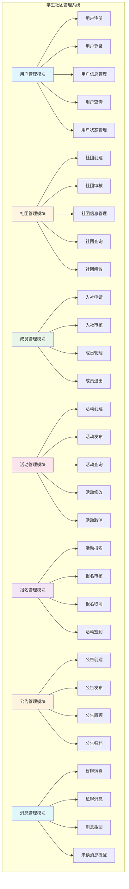
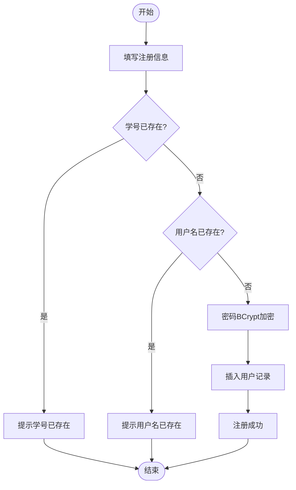
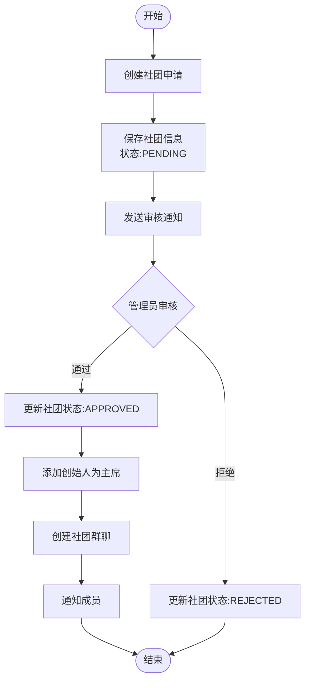
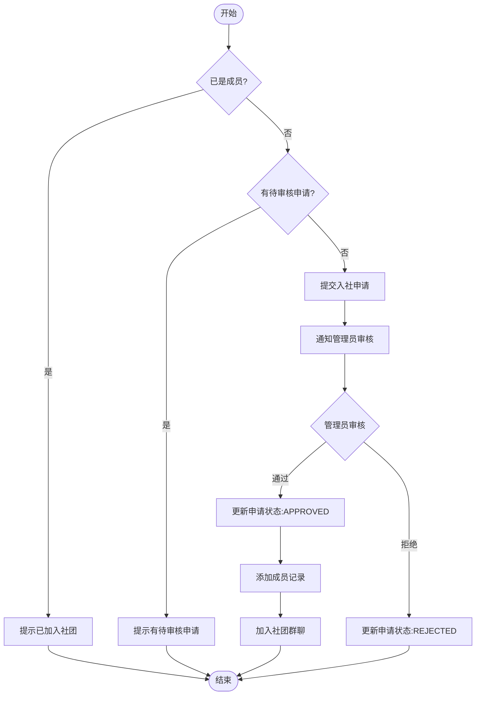
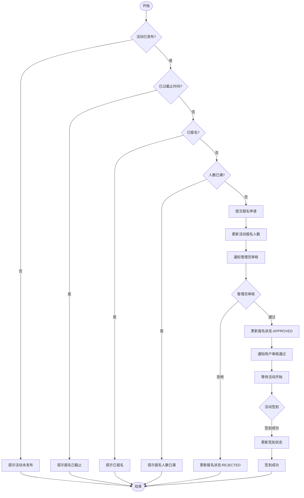
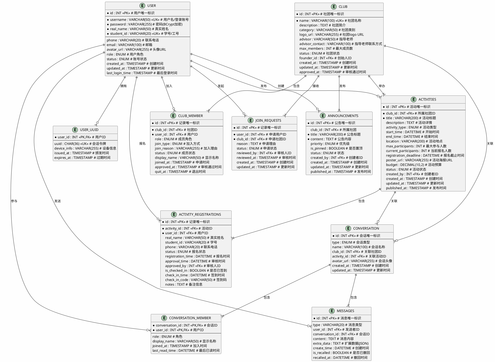
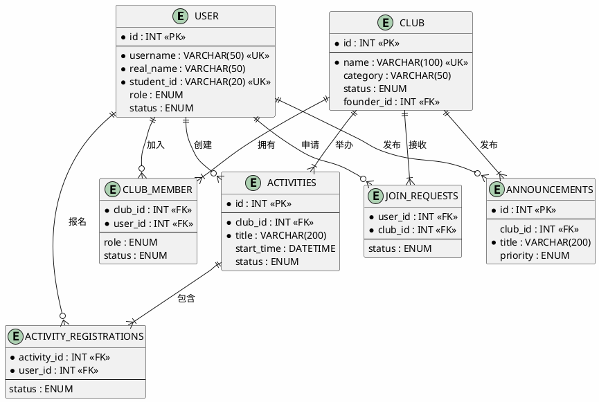

# 数据库课程设计报告

---

## 封面信息

**课程名称**：数据库课程设计

**设计题目**：学生社团管理系统数据库设计

**班级**：请填写班级

**姓名**：请填写姓名

**学号**：请填写学号

**指导教师**：请填写指导教师

**设计时间**：2026年6月15日 - 2026年6月28日

---

## 目录

1. [系统需求分析](#一系统需求分析)
   - 1.1 功能需求分析
   - 1.2 非功能需求分析
   - 1.3 数据字典
   - 1.4 系统模块图
   - 1.5 业务流程图
2. [概念结构设计](#二概念结构设计)
   - 2.1 实体识别
   - 2.2 ER图设计
   - 2.3 实体详细说明
   - 2.4 关系说明
3. [逻辑结构设计](#三逻辑结构设计)
   - 3.1 ER图转换为关系模型
   - 3.2 关系模式定义
   - 3.3 规范化处理
   - 3.4 完整性约束
4. [物理结构设计](#四物理结构设计)
   - 4.1 事务分析
   - 4.2 索引设计
   - 4.3 存储安排
   - 4.4 备份与恢复
5. [SQL语句与存储过程](#五sql语句与存储过程)
   - 5.1 数据表创建SQL
   - 5.2 存储过程设计
   - 5.3 存储过程调用示例
6. [程序验证](#六程序验证)
   - 6.1 验证程序设计
   - 6.2 测试结果
   - 6.3 测试结论

---

# 一、系统需求分析

## 1.1 功能需求分析

### 1.1.1 用户管理功能

| 功能编号 | 功能名称 | 功能描述 |
| :--- | :--- | :--- |
| F-001 | 用户注册 | 学生或教师通过学号/工号注册系统，填写基本信息 |
| F-002 | 用户登录 | 用户通过学号/工号和密码登录系统 |
| F-003 | 用户信息管理 | 用户可修改个人信息（电话、邮箱、头像等） |
| F-004 | 用户查询 | 管理员可查询用户列表，支持按角色、状态筛选 |
| F-005 | 用户状态管理 | 管理员可激活/禁用用户账号 |

### 1.1.2 社团管理功能

| 功能编号 | 功能名称 | 功能描述 |
| :--- | :--- | :--- |
| F-006 | 社团创建 | 用户可申请创建新社团，填写社团基本信息 |
| F-007 | 社团审核 | 管理员审核社团申请，通过或拒绝 |
| F-008 | 社团信息管理 | 社团管理员可修改社团信息 |
| F-009 | 社团查询 | 用户可查询社团列表，支持按类别、状态筛选 |
| F-010 | 社团解散 | 管理员可解散或停用社团 |

### 1.1.3 成员管理功能

| 功能编号 | 功能名称 | 功能描述 |
| :--- | :--- | :--- |
| F-011 | 入社申请 | 用户可申请加入已审核通过的社团 |
| F-012 | 入社审核 | 社团管理员审核入社申请 |
| F-013 | 成员管理 | 社团管理员可管理成员角色、权限 |
| F-014 | 成员退出 | 成员可主动退出社团 |

### 1.1.4 活动管理功能

| 功能编号 | 功能名称 | 功能描述 |
| :--- | :--- | :--- |
| F-015 | 活动创建 | 社团管理员创建活动，填写活动详情 |
| F-016 | 活动发布 | 社团管理员发布活动，使其对学生可见 |
| F-017 | 活动查询 | 学生可查询活动列表，支持按类型、时间筛选 |
| F-018 | 活动修改 | 创建者可修改未发布的活动信息 |
| F-019 | 活动取消 | 创建者可取消已发布的活动 |

### 1.1.5 报名管理功能

| 功能编号 | 功能名称 | 功能描述 |
| :--- | :--- | :--- |
| F-020 | 活动报名 | 学生报名参加活动，填写联系信息 |
| F-021 | 报名审核 | 社团管理员审核报名申请 |
| F-022 | 报名取消 | 学生可取消自己的报名 |
| F-023 | 活动签到 | 学生在活动现场扫码签到 |

### 1.1.6 公告管理功能

| 功能编号 | 功能名称 | 功能描述 |
| :--- | :--- | :--- |
| F-024 | 公告创建 | 管理员或社团管理员创建公告 |
| F-025 | 公告发布 | 创建者发布公告，使其对目标用户可见 |
| F-026 | 公告置顶 | 管理员可将重要公告置顶显示 |
| F-027 | 公告归档 | 管理员可归档过期公告 |

### 1.1.7 消息管理功能

| 功能编号 | 功能名称 | 功能描述 |
| :--- | :--- | :--- |
| F-028 | 群聊消息 | 社团成员可在社团群聊中发送消息 |
| F-029 | 私聊消息 | 用户之间可发送私聊消息 |
| F-030 | 消息撤回 | 发送者可撤回发送的消息 |
| F-031 | 未读消息提醒 | 系统提示用户未读消息数量 |

## 1.2 非功能需求分析

| 需求类型 | 需求描述 | 具体指标 |
| :--- | :--- | :--- |
| 响应时间 | 系统对用户操作的响应时间 | 普通查询 < 2秒，复杂查询 < 5秒 |
| 并发处理 | 系统同时支持的最大在线用户数 | 支持 500+ 用户同时在线 |
| 安全性 | 数据安全和访问控制 | 密码BCrypt加密，角色权限控制 |
| 可用性 | 系统持续运行时间 | 系统可用性 ≥ 99.5% |
| 兼容性 | 支持的浏览器和设备 | 支持主流浏览器和移动设备 |
| 可扩展性 | 系统扩展能力 | 支持横向扩展，分布式部署 |

## 1.3 数据字典

### 1.3.1 用户实体（USER）

| 字段名 | 数据类型 | 长度 | 允许空 | 说明 | 约束 |
| :--- | :--- | :--- | :--- | :--- | :--- |
| id | INT | - | 否 | 用户唯一标识 | PK, AUTO_INCREMENT |
| username | VARCHAR | 50 | 否 | 用户名/登录账号 | UK, NOT NULL |
| password | VARCHAR | 255 | 否 | 密码(BCrypt加密) | NOT NULL |
| real_name | VARCHAR | 50 | 是 | 真实姓名 | - |
| student_id | VARCHAR | 20 | 是 | 学号/工号 | UK |
| phone | VARCHAR | 20 | 是 | 联系电话 | - |
| email | VARCHAR | 100 | 是 | 邮箱 | - |
| avatar_url | VARCHAR | 255 | 是 | 头像URL | - |
| role | ENUM | - | 否 | 用户角色 | NOT NULL |
| status | ENUM | - | 否 | 账号状态 | NOT NULL, DEFAULT 'ACTIVE' |
| created_at | TIMESTAMP | - | 否 | 创建时间 | DEFAULT CURRENT_TIMESTAMP |
| updated_at | TIMESTAMP | - | 否 | 更新时间 | ON UPDATE CURRENT_TIMESTAMP |
| last_login_time | TIMESTAMP | - | 是 | 最后登录时间 | - |

**角色枚举值**：STUDENT（学生）、ADMIN（社团管理员）、SUPER_ADMIN（系统管理员）

**状态枚举值**：ACTIVE（正常）、INACTIVE（未激活）、SUSPENDED（已封禁）

### 1.3.2 社团实体（CLUB）

| 字段名 | 数据类型 | 长度 | 允许空 | 说明 | 约束 |
| :--- | :--- | :--- | :--- | :--- | :--- |
| id | INT | - | 否 | 社团唯一标识 | PK, AUTO_INCREMENT |
| name | VARCHAR | 100 | 否 | 社团名称 | UK, NOT NULL |
| description | TEXT | - | 是 | 社团简介 | - |
| category | VARCHAR | 50 | 是 | 社团类别 | - |
| logo_url | VARCHAR | 255 | 是 | 社团logo URL | - |
| advisor | VARCHAR | 50 | 是 | 指导老师 | - |
| advisor_contact | VARCHAR | 100 | 是 | 指导老师联系方式 | - |
| max_members | INT | - | 否 | 最大成员数 | DEFAULT 100 |
| status | ENUM | - | 否 | 社团状态 | NOT NULL, DEFAULT 'PENDING' |
| founder_id | INT | - | 是 | 创始人ID | FK → user.id |
| created_at | TIMESTAMP | - | 否 | 创建时间 | DEFAULT CURRENT_TIMESTAMP |
| updated_at | TIMESTAMP | - | 否 | 更新时间 | ON UPDATE CURRENT_TIMESTAMP |
| approved_at | TIMESTAMP | - | 是 | 审核通过时间 | - |

**状态枚举值**：PENDING（待审核）、APPROVED（已通过）、REJECTED（已拒绝）、SUSPENDED（已停用）

### 1.3.3 社团成员实体（CLUB_MEMBER）

| 字段名 | 数据类型 | 长度 | 允许空 | 说明 | 约束 |
| :--- | :--- | :--- | :--- | :--- | :--- |
| id | INT | - | 否 | 记录唯一标识 | PK, AUTO_INCREMENT |
| club_id | INT | - | 否 | 社团ID | FK → club.id |
| user_id | INT | - | 否 | 用户ID | FK → user.id |
| role | ENUM | - | 否 | 成员角色 | NOT NULL, DEFAULT 'MEMBER' |
| join_type | ENUM | - | 否 | 加入方式 | NOT NULL, DEFAULT 'APPLY' |
| join_reason | VARCHAR | 255 | 是 | 加入理由 | - |
| status | ENUM | - | 否 | 成员状态 | NOT NULL, DEFAULT 'PENDING' |
| display_name | VARCHAR | 50 | 是 | 显示名称 | - |
| joined_at | TIMESTAMP | - | 否 | 申请时间 | DEFAULT CURRENT_TIMESTAMP |
| approved_at | TIMESTAMP | - | 是 | 审核通过时间 | - |
| quit_at | TIMESTAMP | - | 是 | 退出时间 | - |

**角色枚举值**：PRESIDENT（社长）、VICE_PRESIDENT（副社长）、ADMIN（管理员）、MEMBER（普通成员）

**状态枚举值**：PENDING（待审核）、APPROVED（已通过）、REJECTED（已拒绝）、QUIT（已退出）、EXPELLED（已开除）

### 1.3.4 入社申请实体（JOIN_REQUESTS）

| 字段名 | 数据类型 | 长度 | 允许空 | 说明 | 约束 |
| :--- | :--- | :--- | :--- | :--- | :--- |
| id | INT | - | 否 | 记录唯一标识 | PK, AUTO_INCREMENT |
| user_id | INT | - | 否 | 申请用户ID | FK → user.id |
| club_id | INT | - | 否 | 申请社团ID | FK → club.id |
| reason | TEXT | - | 是 | 申请理由 | - |
| status | ENUM | - | 否 | 申请状态 | NOT NULL, DEFAULT 'PENDING' |
| reviewed_by | INT | - | 是 | 审核人ID | FK → user.id |
| reviewed_at | TIMESTAMP | - | 是 | 审核时间 | - |
| created_at | TIMESTAMP | - | 否 | 创建时间 | DEFAULT CURRENT_TIMESTAMP |
| updated_at | TIMESTAMP | - | 否 | 更新时间 | ON UPDATE CURRENT_TIMESTAMP |

**状态枚举值**：PENDING（待审核）、APPROVED（已通过）、REJECTED（已拒绝）

### 1.3.5 活动实体（ACTIVITIES）

| 字段名 | 数据类型 | 长度 | 允许空 | 说明 | 约束 |
| :--- | :--- | :--- | :--- | :--- | :--- |
| id | INT | - | 否 | 活动唯一标识 | PK, AUTO_INCREMENT |
| club_id | INT | - | 否 | 所属社团ID | FK → club.id |
| title | VARCHAR | 200 | 否 | 活动标题 | NOT NULL |
| description | TEXT | - | 是 | 活动详情 | - |
| activity_type | ENUM | - | 否 | 活动类型 | NOT NULL, DEFAULT 'INTERNAL' |
| start_time | DATETIME | - | 否 | 开始时间 | NOT NULL |
| end_time | DATETIME | - | 否 | 结束时间 | NOT NULL |
| location | VARCHAR | 200 | 是 | 活动地点 | - |
| max_participants | INT | - | 否 | 最大参与人数 | DEFAULT 0 |
| current_participants | INT | - | 否 | 当前报名人数 | DEFAULT 0 |
| registration_deadline | DATETIME | - | 是 | 报名截止时间 | - |
| poster_url | VARCHAR | 255 | 是 | 活动海报URL | - |
| budget | DECIMAL | 10,2 | 否 | 活动预算 | DEFAULT 0.00 |
| status | ENUM | - | 否 | 活动状态 | NOT NULL, DEFAULT 'DRAFT' |
| created_by | INT | - | 否 | 创建者ID | FK → user.id |
| created_at | TIMESTAMP | - | 否 | 创建时间 | DEFAULT CURRENT_TIMESTAMP |
| updated_at | TIMESTAMP | - | 否 | 更新时间 | ON UPDATE CURRENT_TIMESTAMP |
| published_at | TIMESTAMP | - | 是 | 发布时间 | - |

**活动类型枚举值**：INTERNAL（内部活动）、CLUB_ONLY（仅限社团成员）、PUBLIC（公开活动）、COMPETITION（竞赛活动）、TRAINING（培训活动）

**状态枚举值**：DRAFT（草稿）、PUBLISHED（已发布）、IN_PROGRESS（进行中）、COMPLETED（已完成）、CANCELLED（已取消）

### 1.3.6 活动报名实体（ACTIVITY_REGISTRATIONS）

| 字段名 | 数据类型 | 长度 | 允许空 | 说明 | 约束 |
| :--- | :--- | :--- | :--- | :--- | :--- |
| id | INT | - | 否 | 记录唯一标识 | PK, AUTO_INCREMENT |
| activity_id | INT | - | 否 | 活动ID | FK → activities.id |
| user_id | INT | - | 否 | 用户ID | FK → user.id |
| real_name | VARCHAR | 50 | 否 | 真实姓名 | NOT NULL |
| student_id | VARCHAR | 20 | 否 | 学号 | NOT NULL |
| phone | VARCHAR | 20 | 是 | 联系电话 | - |
| status | ENUM | - | 否 | 报名状态 | NOT NULL, DEFAULT 'PENDING' |
| registration_time | DATETIME | - | 否 | 报名时间 | DEFAULT CURRENT_TIMESTAMP |
| approval_time | DATETIME | - | 是 | 审核时间 | - |
| approved_by | INT | - | 是 | 审核人ID | FK → user.id |
| is_checked_in | BOOLEAN | - | 否 | 是否已签到 | DEFAULT FALSE |
| check_in_time | DATETIME | - | 是 | 签到时间 | - |
| check_in_code | VARCHAR | 50 | 是 | 签到码 | - |
| notes | TEXT | - | 是 | 备注信息 | - |

**状态枚举值**：PENDING（待审核）、APPROVED（已通过）、REJECTED（已拒绝）、CANCELLED（已取消）

### 1.3.7 公告实体（ANNOUNCEMENTS）

| 字段名 | 数据类型 | 长度 | 允许空 | 说明 | 约束 |
| :--- | :--- | :--- | :--- | :--- | :--- |
| id | INT | - | 否 | 公告唯一标识 | PK, AUTO_INCREMENT |
| club_id | INT | - | 是 | 所属社团 | FK → club.id |
| title | VARCHAR | 200 | 否 | 公告标题 | NOT NULL |
| content | TEXT | - | 否 | 公告内容 | NOT NULL |
| priority | ENUM | - | 否 | 优先级 | NOT NULL, DEFAULT 'NORMAL' |
| is_pinned | BOOLEAN | - | 否 | 是否置顶 | DEFAULT FALSE |
| status | ENUM | - | 否 | 状态 | NOT NULL, DEFAULT 'DRAFT' |
| created_by | INT | - | 否 | 创建者ID | FK → user.id |
| created_at | TIMESTAMP | - | 否 | 创建时间 | DEFAULT CURRENT_TIMESTAMP |
| updated_at | TIMESTAMP | - | 否 | 更新时间 | ON UPDATE CURRENT_TIMESTAMP |
| published_at | TIMESTAMP | - | 是 | 发布时间 | - |

**优先级枚举值**：NORMAL（普通）、IMPORTANT（重要）、URGENT（紧急）

**状态枚举值**：DRAFT（草稿）、PUBLISHED（已发布）、ARCHIVED（已归档）

### 1.3.8 会话实体（CONVERSATION）

| 字段名 | 数据类型 | 长度 | 允许空 | 说明 | 约束 |
| :--- | :--- | :--- | :--- | :--- | :--- |
| id | INT | - | 否 | 会话唯一标识 | PK, AUTO_INCREMENT |
| type | ENUM | - | 否 | 会话类型 | NOT NULL |
| name | VARCHAR | 100 | 是 | 会话名称 | - |
| club_id | INT | - | 是 | 关联社团ID | FK → club.id |
| activity_id | INT | - | 是 | 关联活动ID | FK → activities.id |
| avatar_url | VARCHAR | 255 | 是 | 会话头像 | - |
| created_at | TIMESTAMP | - | 否 | 创建时间 | DEFAULT CURRENT_TIMESTAMP |
| updated_at | TIMESTAMP | - | 否 | 更新时间 | ON UPDATE CURRENT_TIMESTAMP |

**会话类型枚举值**：PRIVATE（私聊）、CLUB（社团群聊）、ACTIVITY（活动讨论）

### 1.3.9 会话成员实体（CONVERSATION_MEMBER）

| 字段名 | 数据类型 | 长度 | 允许空 | 说明 | 约束 |
| :--- | :--- | :--- | :--- | :--- | :--- |
| conversation_id | INT | - | 否 | 会话ID | PK, FK → conversation.id |
| user_id | INT | - | 否 | 用户ID | PK, FK → user.id |
| role | ENUM | - | 是 | 角色 | - |
| display_name | VARCHAR | 50 | 是 | 显示名称 | - |
| joined_at | TIMESTAMP | - | 否 | 加入时间 | DEFAULT CURRENT_TIMESTAMP |
| last_read_time | DATETIME | - | 是 | 最后已读时间 | - |

**角色枚举值**：OWNER（群主）、ADMIN（管理员）、MEMBER（成员）

### 1.3.10 消息实体（MESSAGES）

| 字段名 | 数据类型 | 长度 | 允许空 | 说明 | 约束 |
| :--- | :--- | :--- | :--- | :--- | :--- |
| id | INT | - | 否 | 消息唯一标识 | PK, AUTO_INCREMENT |
| type | VARCHAR | 20 | 否 | 消息类型 | NOT NULL |
| user_id | INT | - | 否 | 发送者ID | FK → user.id |
| conversation_id | INT | - | 否 | 会话ID | FK → conversation.id |
| content | TEXT | - | 是 | 消息内容 | - |
| extra_data | TEXT | - | 是 | 扩展数据(JSON) | - |
| create_time | DATETIME | - | 否 | 创建时间 | DEFAULT CURRENT_TIMESTAMP |
| is_recalled | BOOLEAN | - | 否 | 是否已撤回 | DEFAULT FALSE |
| recalled_at | DATETIME | - | 是 | 撤回时间 | - |

**消息类型**：TEXT（文本）、IMAGE（图片）、FILE（文件）、VOICE（语音）

### 1.3.11 用户令牌实体（USER_UUID）

| 字段名 | 数据类型 | 长度 | 允许空 | 说明 | 约束 |
| :--- | :--- | :--- | :--- | :--- | :--- |
| user_id | INT | - | 否 | 用户ID | PK, FK → user.id |
| uuid | CHAR | 36 | 否 | 会话令牌 | UK |
| device_info | VARCHAR | 255 | 是 | 设备信息 | - |
| issued_at | TIMESTAMP | - | 否 | 颁发时间 | DEFAULT CURRENT_TIMESTAMP |
| expires_at | TIMESTAMP | - | 是 | 过期时间 | - |

## 1.4 系统模块图



## 1.5 业务流程图

### 1.5.1 用户注册流程



### 1.5.2 社团创建与审核流程



### 1.5.3 入社申请与审核流程



### 1.5.4 活动报名与签到流程



---

# 二、概念结构设计

## 2.1 实体识别

根据需求分析，系统包含以下核心实体：

| 序号 | 实体名称 | 英文名称 | 说明 |
| :--- | :--- | :--- | :--- |
| 1 | 用户 | USER | 系统用户，包括学生、教师、管理员 |
| 2 | 社团 | CLUB | 学生社团组织 |
| 3 | 社团成员 | CLUB_MEMBER | 社团与用户的关联关系 |
| 4 | 入社申请 | JOIN_REQUESTS | 用户申请加入社团的记录 |
| 5 | 活动 | ACTIVITIES | 社团举办的活动 |
| 6 | 活动报名 | ACTIVITY_REGISTRATIONS | 用户报名参加活动的记录 |
| 7 | 公告 | ANNOUNCEMENTS | 系统或社团发布的公告 |
| 8 | 会话 | CONVERSATION | 消息会话（群聊/私聊） |
| 9 | 会话成员 | CONVERSATION_MEMBER | 会话与用户的关联关系 |
| 10 | 消息 | MESSAGES | 会话中的消息记录 |
| 11 | 用户令牌 | USER_UUID | 用户登录会话令牌 |

## 2.2 ER图设计

### 2.2.1 完整ER图



### 2.2.2 简化ER图



## 2.3 实体详细说明

**实体说明已在1.3数据字典中详细描述**

## 2.4 关系说明

### 2.4.1 关系矩阵

| 关系 | 实体1 | 实体2 | 基数 | 说明 |
| :--- | :--- | :--- | :--- | :--- |
| 创建 | USER | CLUB | 1:N | 一个用户可以创建多个社团 |
| 加入 | USER | CLUB_MEMBER | 1:N | 一个用户可以加入多个社团 |
| 包含 | CLUB | CLUB_MEMBER | 1:N | 一个社团有多个成员 |
| 发起 | USER | JOIN_REQUESTS | 1:N | 一个用户可以发起多个入社申请 |
| 接收 | CLUB | JOIN_REQUESTS | 1:N | 一个社团可以接收多个入社申请 |
| 创建 | USER | ACTIVITIES | 1:N | 一个用户可以创建多个活动 |
| 举办 | CLUB | ACTIVITIES | 1:N | 一个社团可以举办多个活动 |
| 报名 | USER | ACTIVITY_REGISTRATIONS | 1:N | 一个用户可以报名多个活动 |
| 包含 | ACTIVITIES | ACTIVITY_REGISTRATIONS | 1:N | 一个活动有多个报名记录 |
| 发布 | USER | ANNOUNCEMENTS | 1:N | 一个用户可以发布多个公告 |
| 发布 | CLUB | ANNOUNCEMENTS | 1:N | 一个社团可以发布多个公告 |
| 关联 | CLUB | CONVERSATION | 1:1 | 一个社团关联一个群聊会话 |
| 关联 | ACTIVITIES | CONVERSATION | 1:1 | 一个活动关联一个讨论会话 |
| 参与 | USER | CONVERSATION_MEMBER | 1:N | 一个用户可以参与多个会话 |
| 包含 | CONVERSATION | CONVERSATION_MEMBER | 1:N | 一个会话有多个成员 |
| 发送 | USER | MESSAGES | 1:N | 一个用户可以发送多条消息 |
| 包含 | CONVERSATION | MESSAGES | 1:N | 一个会话包含多条消息 |
| 拥有 | USER | USER_UUID | 1:1 | 一个用户拥有一个会话令牌 |

### 2.4.2 关系约束说明

1. **用户与社团的关系**：
   - 用户可以创建多个社团（1:N）
   - 用户可以加入多个社团（1:N）
   - 社团必须有一个创始人

2. **社团与成员的关系**：
   - 社团与成员是一对多关系
   - 一个用户在一个社团中只能有一条记录（唯一约束）

3. **活动与报名的关系**：
   - 活动与报名是一对多关系
   - 一个用户在一个活动中只能报名一次（唯一约束）

4. **公告的特殊关系**：
   - club_id为NULL表示系统公告
   - club_id非NULL表示社团公告

5. **会话与社团/活动的关系**：
   - 社团群聊：type='CLUB'，关联club_id
   - 活动讨论：type='ACTIVITY'，关联activity_id
   - 私聊：type='PRIVATE'，不关联其他实体

## 2.5 概念模型特点

### 2.5.1 继承关系

系统中存在以下继承关系：
- **用户角色继承**：STUDENT → ADMIN → SUPER_ADMIN，权限逐级递增
- **社团成员角色继承**：MEMBER → ADMIN → VICE_PRESIDENT → PRESIDENT，权限逐级递增

### 2.5.2 状态机

**用户状态机**：
```
ACTIVE ↔ INACTIVE ↔ SUSPENDED
```

**社团状态机**：
```
PENDING → APPROVED → SUSPENDED
  ↓
REJECTED
```

**活动状态机**：
```
DRAFT → PUBLISHED → IN_PROGRESS → COMPLETED
            ↓
        CANCELLED
```

**报名状态机**：
```
PENDING → APPROVED
   ↓
REJECTED
```

---

# 三、逻辑结构设计

## 3.1 ER图转换为关系模型

将ER图转换为关系模型，每个实体转换为一个关系表，多对多关系转换为中间表。

### 3.1.1 转换规则

1. **实体转换**：每个实体转换为一个关系表
2. **1:N关系转换**：在"N端"表中添加"1端"的外键
3. **M:N关系转换**：创建新的关系表，包含两个实体的外键
4. **属性转换**：实体的每个属性转换为表的列
5. **主键转换**：实体的主键转换为表的主键
6. **外键转换**：实体间的联系转换为表的外键

### 3.1.2 转换结果

| 关系模式 | 主键 | 外键 |
| :--- | :--- | :--- |
| USER(id, username, password, real_name, student_id, phone, email, avatar_url, role, status, created_at, updated_at, last_login_time) | id | - |
| CLUB(id, name, description, category, logo_url, advisor, advisor_contact, max_members, status, founder_id, created_at, updated_at, approved_at) | id | founder_id → USER(id) |
| CLUB_MEMBER(id, club_id, user_id, role, join_type, join_reason, status, display_name, joined_at, approved_at, quit_at) | id | club_id → CLUB(id), user_id → USER(id) |
| JOIN_REQUESTS(id, user_id, club_id, reason, status, reviewed_by, reviewed_at, created_at, updated_at) | id | user_id → USER(id), club_id → CLUB(id), reviewed_by → USER(id) |
| ACTIVITIES(id, club_id, title, description, activity_type, start_time, end_time, location, max_participants, current_participants, registration_deadline, poster_url, budget, status, created_by, created_at, updated_at, published_at) | id | club_id → CLUB(id), created_by → USER(id) |
| ACTIVITY_REGISTRATIONS(id, activity_id, user_id, real_name, student_id, phone, status, registration_time, approval_time, approved_by, is_checked_in, check_in_time, check_in_code, notes) | id | activity_id → ACTIVITIES(id), user_id → USER(id), approved_by → USER(id) |
| ANNOUNCEMENTS(id, club_id, title, content, priority, is_pinned, status, created_by, created_at, updated_at, published_at) | id | club_id → CLUB(id), created_by → USER(id) |
| CONVERSATION(id, type, name, club_id, activity_id, avatar_url, created_at, updated_at) | id | club_id → CLUB(id), activity_id → ACTIVITIES(id) |
| CONVERSATION_MEMBER(conversation_id, user_id, role, display_name, joined_at, last_read_time) | (conversation_id, user_id) | conversation_id → CONVERSATION(id), user_id → USER(id) |
| MESSAGES(id, type, user_id, conversation_id, content, extra_data, create_time, is_recalled, recalled_at) | id | user_id → USER(id), conversation_id → CONVERSATION(id) |
| USER_UUID(user_id, uuid, device_info, issued_at, expires_at) | user_id | user_id → USER(id) |

## 3.2 关系模式定义

### 3.2.1 用户表（user）

```sql
CREATE TABLE user (
    id INT PRIMARY KEY AUTO_INCREMENT COMMENT '用户唯一标识',
    username VARCHAR(50) UNIQUE NOT NULL COMMENT '用户名/登录账号',
    password VARCHAR(255) NOT NULL COMMENT '密码(BCrypt加密)',
    real_name VARCHAR(50) COMMENT '真实姓名',
    student_id VARCHAR(20) UNIQUE COMMENT '学号/工号',
    phone VARCHAR(20) COMMENT '联系电话',
    email VARCHAR(100) COMMENT '邮箱',
    avatar_url VARCHAR(255) COMMENT '头像URL',
    role ENUM('STUDENT', 'ADMIN', 'SUPER_ADMIN') NOT NULL DEFAULT 'STUDENT' COMMENT '用户角色',
    status ENUM('ACTIVE', 'INACTIVE', 'SUSPENDED') NOT NULL DEFAULT 'ACTIVE' COMMENT '账号状态',
    created_at TIMESTAMP DEFAULT CURRENT_TIMESTAMP COMMENT '创建时间',
    updated_at TIMESTAMP DEFAULT CURRENT_TIMESTAMP ON UPDATE CURRENT_TIMESTAMP COMMENT '更新时间',
    last_login_time TIMESTAMP NULL COMMENT '最后登录时间',
    INDEX idx_username (username),
    INDEX idx_student_id (student_id),
    INDEX idx_role (role),
    INDEX idx_status (status)
) ENGINE=InnoDB DEFAULT CHARSET=utf8mb4 COMMENT='用户表';
```

### 3.2.2 社团表（club）

```sql
CREATE TABLE club (
    id INT PRIMARY KEY AUTO_INCREMENT COMMENT '社团唯一标识',
    name VARCHAR(100) UNIQUE NOT NULL COMMENT '社团名称',
    description TEXT COMMENT '社团简介',
    category VARCHAR(50) COMMENT '社团类别',
    logo_url VARCHAR(255) COMMENT '社团logo URL',
    advisor VARCHAR(50) COMMENT '指导老师',
    advisor_contact VARCHAR(100) COMMENT '指导老师联系方式',
    max_members INT DEFAULT 100 COMMENT '最大成员数',
    status ENUM('PENDING', 'APPROVED', 'REJECTED', 'SUSPENDED') NOT NULL DEFAULT 'PENDING' COMMENT '社团状态',
    founder_id INT COMMENT '创始人ID',
    created_at TIMESTAMP DEFAULT CURRENT_TIMESTAMP COMMENT '创建时间',
    updated_at TIMESTAMP DEFAULT CURRENT_TIMESTAMP ON UPDATE CURRENT_TIMESTAMP COMMENT '更新时间',
    approved_at TIMESTAMP NULL COMMENT '审核通过时间',
    FOREIGN KEY (founder_id) REFERENCES user(id) ON DELETE SET NULL,
    INDEX idx_name (name),
    INDEX idx_category (category),
    INDEX idx_status (status),
    INDEX idx_founder_id (founder_id)
) ENGINE=InnoDB DEFAULT CHARSET=utf8mb4 COMMENT='社团表';
```

### 3.2.3 社团成员表（club_member）

```sql
CREATE TABLE club_member (
    id INT PRIMARY KEY AUTO_INCREMENT COMMENT '记录唯一标识',
    club_id INT NOT NULL COMMENT '社团ID',
    user_id INT NOT NULL COMMENT '用户ID',
    role ENUM('PRESIDENT', 'VICE_PRESIDENT', 'ADMIN', 'MEMBER') NOT NULL DEFAULT 'MEMBER' COMMENT '成员角色',
    join_type ENUM('APPLY', 'INVITE') NOT NULL DEFAULT 'APPLY' COMMENT '加入方式',
    join_reason VARCHAR(255) COMMENT '加入理由',
    status ENUM('PENDING', 'APPROVED', 'REJECTED', 'QUIT', 'EXPELLED') NOT NULL DEFAULT 'PENDING' COMMENT '成员状态',
    display_name VARCHAR(50) COMMENT '显示名称',
    joined_at TIMESTAMP DEFAULT CURRENT_TIMESTAMP COMMENT '申请时间',
    approved_at TIMESTAMP NULL COMMENT '审核通过时间',
    quit_at TIMESTAMP NULL COMMENT '退出时间',
    FOREIGN KEY (club_id) REFERENCES club(id) ON DELETE CASCADE,
    FOREIGN KEY (user_id) REFERENCES user(id) ON DELETE CASCADE,
    UNIQUE KEY unique_club_member (club_id, user_id),
    INDEX idx_club_id (club_id),
    INDEX idx_user_id (user_id),
    INDEX idx_status (status),
    INDEX idx_role (role)
) ENGINE=InnoDB DEFAULT CHARSET=utf8mb4 COMMENT='社团成员表';
```

### 3.2.4 入社申请表（join_requests）

```sql
CREATE TABLE join_requests (
    id INT PRIMARY KEY AUTO_INCREMENT COMMENT '记录唯一标识',
    user_id INT NOT NULL COMMENT '申请用户ID',
    club_id INT NOT NULL COMMENT '申请社团ID',
    reason TEXT COMMENT '申请理由',
    status ENUM('PENDING', 'APPROVED', 'REJECTED') NOT NULL DEFAULT 'PENDING' COMMENT '申请状态',
    reviewed_by INT COMMENT '审核人ID',
    reviewed_at TIMESTAMP NULL COMMENT '审核时间',
    created_at TIMESTAMP DEFAULT CURRENT_TIMESTAMP COMMENT '创建时间',
    updated_at TIMESTAMP DEFAULT CURRENT_TIMESTAMP ON UPDATE CURRENT_TIMESTAMP COMMENT '更新时间',
    FOREIGN KEY (user_id) REFERENCES user(id) ON DELETE CASCADE,
    FOREIGN KEY (club_id) REFERENCES club(id) ON DELETE CASCADE,
    FOREIGN KEY (reviewed_by) REFERENCES user(id) ON DELETE SET NULL,
    UNIQUE KEY unique_pending_request (user_id, club_id, status),
    INDEX idx_user_id (user_id),
    INDEX idx_club_id (club_id),
    INDEX idx_status (status),
    INDEX idx_created_at (created_at)
) ENGINE=InnoDB DEFAULT CHARSET=utf8mb4 COMMENT='入社申请表';
```

### 3.2.5 活动表（activities）

```sql
CREATE TABLE activities (
    id INT PRIMARY KEY AUTO_INCREMENT COMMENT '活动唯一标识',
    club_id INT NOT NULL COMMENT '所属社团ID',
    title VARCHAR(200) NOT NULL COMMENT '活动标题',
    description TEXT COMMENT '活动详情',
    activity_type ENUM('INTERNAL', 'CLUB_ONLY', 'PUBLIC', 'COMPETITION', 'TRAINING') NOT NULL DEFAULT 'INTERNAL' COMMENT '活动类型',
    start_time DATETIME NOT NULL COMMENT '开始时间',
    end_time DATETIME NOT NULL COMMENT '结束时间',
    location VARCHAR(200) COMMENT '活动地点',
    max_participants INT DEFAULT 0 COMMENT '最大参与人数',
    current_participants INT DEFAULT 0 COMMENT '当前报名人数',
    registration_deadline DATETIME COMMENT '报名截止时间',
    poster_url VARCHAR(255) COMMENT '活动海报URL',
    budget DECIMAL(10,2) DEFAULT 0.00 COMMENT '活动预算',
    status ENUM('DRAFT', 'PUBLISHED', 'IN_PROGRESS', 'COMPLETED', 'CANCELLED') NOT NULL DEFAULT 'DRAFT' COMMENT '活动状态',
    created_by INT NOT NULL COMMENT '创建者ID',
    created_at TIMESTAMP DEFAULT CURRENT_TIMESTAMP COMMENT '创建时间',
    updated_at TIMESTAMP DEFAULT CURRENT_TIMESTAMP ON UPDATE CURRENT_TIMESTAMP COMMENT '更新时间',
    published_at TIMESTAMP NULL COMMENT '发布时间',
    FOREIGN KEY (club_id) REFERENCES club(id) ON DELETE CASCADE,
    FOREIGN KEY (created_by) REFERENCES user(id) ON DELETE SET NULL,
    INDEX idx_club_id (club_id),
    INDEX idx_title (title),
    INDEX idx_activity_type (activity_type),
    INDEX idx_start_time (start_time),
    INDEX idx_status (status),
    INDEX idx_created_by (created_by)
) ENGINE=InnoDB DEFAULT CHARSET=utf8mb4 COMMENT='活动表';
```

### 3.2.6 活动报名表（activity_registrations）

```sql
CREATE TABLE activity_registrations (
    id INT PRIMARY KEY AUTO_INCREMENT COMMENT '记录唯一标识',
    activity_id INT NOT NULL COMMENT '活动ID',
    user_id INT NOT NULL COMMENT '用户ID',
    real_name VARCHAR(50) NOT NULL COMMENT '真实姓名',
    student_id VARCHAR(20) NOT NULL COMMENT '学号',
    phone VARCHAR(20) COMMENT '联系电话',
    status ENUM('PENDING', 'APPROVED', 'REJECTED', 'CANCELLED') NOT NULL DEFAULT 'PENDING' COMMENT '报名状态',
    registration_time DATETIME DEFAULT CURRENT_TIMESTAMP COMMENT '报名时间',
    approval_time DATETIME COMMENT '审核时间',
    approved_by INT COMMENT '审核人ID',
    is_checked_in BOOLEAN DEFAULT FALSE COMMENT '是否已签到',
    check_in_time DATETIME COMMENT '签到时间',
    check_in_code VARCHAR(50) COMMENT '签到码',
    notes TEXT COMMENT '备注信息',
    FOREIGN KEY (activity_id) REFERENCES activities(id) ON DELETE CASCADE,
    FOREIGN KEY (user_id) REFERENCES user(id) ON DELETE CASCADE,
    FOREIGN KEY (approved_by) REFERENCES user(id) ON DELETE SET NULL,
    UNIQUE KEY unique_activity_registration (activity_id, user_id),
    INDEX idx_activity_id (activity_id),
    INDEX idx_user_id (user_id),
    INDEX idx_status (status),
    INDEX idx_registration_time (registration_time)
) ENGINE=InnoDB DEFAULT CHARSET=utf8mb4 COMMENT='活动报名表';
```

### 3.2.7 公告表（announcements）

```sql
CREATE TABLE announcements (
    id INT PRIMARY KEY AUTO_INCREMENT COMMENT '公告唯一标识',
    club_id INT COMMENT '所属社团',
    title VARCHAR(200) NOT NULL COMMENT '公告标题',
    content TEXT NOT NULL COMMENT '公告内容',
    priority ENUM('NORMAL', 'IMPORTANT', 'URGENT') NOT NULL DEFAULT 'NORMAL' COMMENT '优先级',
    is_pinned BOOLEAN DEFAULT FALSE COMMENT '是否置顶',
    status ENUM('DRAFT', 'PUBLISHED', 'ARCHIVED') NOT NULL DEFAULT 'DRAFT' COMMENT '状态',
    created_by INT NOT NULL COMMENT '创建者ID',
    created_at TIMESTAMP DEFAULT CURRENT_TIMESTAMP COMMENT '创建时间',
    updated_at TIMESTAMP DEFAULT CURRENT_TIMESTAMP ON UPDATE CURRENT_TIMESTAMP COMMENT '更新时间',
    published_at TIMESTAMP NULL COMMENT '发布时间',
    FOREIGN KEY (club_id) REFERENCES club(id) ON DELETE CASCADE,
    FOREIGN KEY (created_by) REFERENCES user(id) ON DELETE SET NULL,
    INDEX idx_club_id (club_id),
    INDEX idx_title (title),
    INDEX idx_priority (priority),
    INDEX idx_status (status),
    INDEX idx_is_pinned (is_pinned),
    INDEX idx_published_at (published_at)
) ENGINE=InnoDB DEFAULT CHARSET=utf8mb4 COMMENT='公告表';
```

### 3.2.8 会话表（conversation）

```sql
CREATE TABLE conversation (
    id INT PRIMARY KEY AUTO_INCREMENT COMMENT '会话唯一标识',
    type ENUM('PRIVATE', 'CLUB', 'ACTIVITY') NOT NULL COMMENT '会话类型',
    name VARCHAR(100) COMMENT '会话名称',
    club_id INT COMMENT '关联社团ID',
    activity_id INT COMMENT '关联活动ID',
    avatar_url VARCHAR(255) COMMENT '会话头像',
    created_at TIMESTAMP DEFAULT CURRENT_TIMESTAMP COMMENT '创建时间',
    updated_at TIMESTAMP DEFAULT CURRENT_TIMESTAMP ON UPDATE CURRENT_TIMESTAMP COMMENT '更新时间',
    FOREIGN KEY (club_id) REFERENCES club(id) ON DELETE CASCADE,
    FOREIGN KEY (activity_id) REFERENCES activities(id) ON DELETE CASCADE,
    INDEX idx_type (type),
    INDEX idx_club_id (club_id),
    INDEX idx_activity_id (activity_id),
    INDEX idx_updated_at (updated_at)
) ENGINE=InnoDB DEFAULT CHARSET=utf8mb4 COMMENT='会话表';
```

### 3.2.9 会话成员表（conversation_member）

```sql
CREATE TABLE conversation_member (
    conversation_id INT NOT NULL COMMENT '会话ID',
    user_id INT NOT NULL COMMENT '用户ID',
    role ENUM('OWNER', 'ADMIN', 'MEMBER') COMMENT '角色',
    display_name VARCHAR(50) COMMENT '显示名称',
    joined_at TIMESTAMP DEFAULT CURRENT_TIMESTAMP COMMENT '加入时间',
    last_read_time DATETIME COMMENT '最后已读时间',
    PRIMARY KEY (conversation_id, user_id),
    FOREIGN KEY (conversation_id) REFERENCES conversation(id) ON DELETE CASCADE,
    FOREIGN KEY (user_id) REFERENCES user(id) ON DELETE CASCADE,
    INDEX idx_user_id (user_id),
    INDEX idx_joined_at (joined_at)
) ENGINE=InnoDB DEFAULT CHARSET=utf8mb4 COMMENT='会话成员表';
```

### 3.2.10 消息表（messages）

```sql
CREATE TABLE messages (
    id INT PRIMARY KEY AUTO_INCREMENT COMMENT '消息唯一标识',
    type VARCHAR(20) NOT NULL COMMENT '消息类型',
    user_id INT NOT NULL COMMENT '发送者ID',
    conversation_id INT NOT NULL COMMENT '会话ID',
    content TEXT COMMENT '消息内容',
    extra_data TEXT COMMENT '扩展数据(JSON)',
    create_time DATETIME DEFAULT CURRENT_TIMESTAMP COMMENT '创建时间',
    is_recalled BOOLEAN DEFAULT FALSE COMMENT '是否已撤回',
    recalled_at DATETIME COMMENT '撤回时间',
    FOREIGN KEY (user_id) REFERENCES user(id) ON DELETE CASCADE,
    FOREIGN KEY (conversation_id) REFERENCES conversation(id) ON DELETE CASCADE,
    INDEX idx_conversation_id (conversation_id),
    INDEX idx_user_id (user_id),
    INDEX idx_create_time (create_time),
    INDEX idx_is_recalled (is_recalled)
) ENGINE=InnoDB DEFAULT CHARSET=utf8mb4 COMMENT='消息表';
```

### 3.2.11 用户令牌表（user_uuid）

```sql
CREATE TABLE user_uuid (
    user_id INT PRIMARY KEY COMMENT '用户ID',
    uuid CHAR(36) UNIQUE NOT NULL COMMENT '会话令牌',
    device_info VARCHAR(255) COMMENT '设备信息',
    issued_at TIMESTAMP DEFAULT CURRENT_TIMESTAMP COMMENT '颁发时间',
    expires_at TIMESTAMP COMMENT '过期时间',
    FOREIGN KEY (user_id) REFERENCES user(id) ON DELETE CASCADE,
    INDEX idx_uuid (uuid),
    INDEX idx_expires_at (expires_at)
) ENGINE=InnoDB DEFAULT CHARSET=utf8mb4 COMMENT='用户令牌表';
```

## 3.3 规范化处理

### 3.3.1 第一范式（1NF）

**检查结果**：所有表满足第一范式要求

- 所有字段都是原子值，不可再分
- 每个表都有一个主键
- 每个字段都是单一值，没有重复组

### 3.3.2 第二范式（2NF）

**检查结果**：所有表满足第二范式要求

- 所有非主键字段都完全依赖于主键
- 消除了部分依赖

**示例检查**：
- CLUB_MEMBER表：(club_id, user_id)为复合主键，role、status等字段都依赖于整个主键

### 3.3.3 第三范式（3NF）

**检查结果**：所有表满足第三范式要求

- 所有非主键字段都不传递依赖于主键
- 消除了传递依赖

**示例检查**：
- ACTIVITIES表：club_id、created_by都直接依赖主键id，没有传递依赖

### 3.3.4 BCNF（Boyce-Codd范式）

**检查结果**：所有表满足BCNF要求

- 所有决定因素都是候选键
- 满足3NF且消除了多值依赖

### 3.3.5 规范化总结

| 表名 | 1NF | 2NF | 3NF | BCNF | 说明 |
| :--- | :--- | :--- | :--- | :--- | :--- |
| user | ✅ | ✅ | ✅ | ✅ | 满足所有范式 |
| club | ✅ | ✅ | ✅ | ✅ | 满足所有范式 |
| club_member | ✅ | ✅ | ✅ | ✅ | 满足所有范式 |
| join_requests | ✅ | ✅ | ✅ | ✅ | 满足所有范式 |
| activities | ✅ | ✅ | ✅ | ✅ | 满足所有范式 |
| activity_registrations | ✅ | ✅ | ✅ | ✅ | 满足所有范式 |
| announcements | ✅ | ✅ | ✅ | ✅ | 满足所有范式 |
| conversation | ✅ | ✅ | ✅ | ✅ | 满足所有范式 |
| conversation_member | ✅ | ✅ | ✅ | ✅ | 满足所有范式 |
| messages | ✅ | ✅ | ✅ | ✅ | 满足所有范式 |
| user_uuid | ✅ | ✅ | ✅ | ✅ | 满足所有范式 |

## 3.4 完整性约束

### 3.4.1 实体完整性

- 每个表都有主键约束
- 主键值唯一且不为空

### 3.4.2 参照完整性

- 所有外键都有对应的参照表
- 外键值必须存在于参照表的主键中
- 设置了适当的删除和更新策略（CASCADE、SET NULL等）

### 3.4.3 域完整性

- 使用ENUM类型限制字段的取值范围
- 设置NOT NULL约束确保关键字段不为空
- 设置DEFAULT值提供默认值

### 3.4.4 用户定义完整性

- 使用UNIQUE约束确保数据唯一性
- 使用CHECK约束验证数据有效性
- 业务规则通过应用程序逻辑实现

### 3.4.5 完整性约束总结

| 约束类型 | 数量 | 说明 |
| :--- | :--- | :--- |
| PRIMARY KEY | 11 | 每个表一个主键 |
| FOREIGN KEY | 21 | 跨表关系约束 |
| UNIQUE KEY | 5 | 唯一性约束 |
| INDEX | 41 | 普通索引 |
| ENUM约束 | 11 | 枚举类型约束 |
| NOT NULL | 多个 | 非空约束 |
| DEFAULT | 多个 | 默认值约束 |

---

# 四、物理结构设计

## 4.1 事务分析

### 4.1.1 事务定义

根据系统功能需求，设计以下核心事务：

#### T1：用户注册事务

```sql
BEGIN TRANSACTION;
    -- 1. 检查学号是否已存在
    SELECT COUNT(*) FROM user WHERE student_id = ?;
    
    -- 2. 检查用户名是否已存在
    SELECT COUNT(*) FROM user WHERE username = ?;
    
    -- 3. 插入用户记录
    INSERT INTO user (username, password, real_name, student_id, role, status)
    VALUES (?, ?, ?, ?, 'STUDENT', 'ACTIVE');
    
COMMIT;
```

#### T2：社团创建与审核事务

```sql
-- 社团创建
BEGIN TRANSACTION;
    -- 1. 插入社团记录
    INSERT INTO club (name, description, category, advisor, max_members, founder_id, status)
    VALUES (?, ?, ?, ?, ?, ?, 'PENDING');
COMMIT;

-- 社团审核（管理员）
BEGIN TRANSACTION;
    -- 1. 更新社团状态
    UPDATE club SET status = 'APPROVED', approved_at = NOW() WHERE id = ?;
    
    -- 2. 添加创始人为社长
    INSERT INTO club_member (club_id, user_id, role, status, approved_at)
    SELECT ?, founder_id, 'PRESIDENT', 'APPROVED', NOW() FROM club WHERE id = ?;
    
    -- 3. 创建社团群聊
    INSERT INTO conversation (type, name, club_id)
    VALUES ('CLUB', CONCAT((SELECT name FROM club WHERE id = ?), '群聊'), ?);
    
    -- 4. 添加创始人为群聊成员
    INSERT INTO conversation_member (conversation_id, user_id, role)
    SELECT LAST_INSERT_ID(), founder_id, 'OWNER' FROM club WHERE id = ?;
COMMIT;
```

#### T3：入社申请与审核事务

```sql
-- 入社申请
BEGIN TRANSACTION;
    -- 1. 检查是否已加入社团
    SELECT COUNT(*) FROM club_member WHERE club_id = ? AND user_id = ?;
    
    -- 2. 检查是否有待审核申请
    SELECT COUNT(*) FROM join_requests WHERE club_id = ? AND user_id = ? AND status = 'PENDING';
    
    -- 3. 插入申请记录
    INSERT INTO join_requests (user_id, club_id, reason, status)
    VALUES (?, ?, ?, 'PENDING');
COMMIT;

-- 入社审核
BEGIN TRANSACTION;
    -- 1. 更新申请状态
    UPDATE join_requests SET status = 'APPROVED', reviewed_by = ?, reviewed_at = NOW() WHERE id = ?;
    
    -- 2. 添加成员记录
    INSERT INTO club_member (club_id, user_id, role, status, approved_at)
    SELECT club_id, user_id, 'MEMBER', 'APPROVED', NOW() FROM join_requests WHERE id = ?;
    
    -- 3. 添加到社团群聊
    INSERT INTO conversation_member (conversation_id, user_id, role)
    SELECT id, user_id, 'MEMBER' FROM conversation WHERE club_id = ? AND type = 'CLUB';
COMMIT;
```

#### T4：活动报名与签到事务

```sql
-- 活动报名
BEGIN TRANSACTION;
    -- 1. 检查活动状态
    SELECT status, max_participants, current_participants, registration_deadline 
    FROM activities WHERE id = ?;
    
    -- 2. 检查是否已报名
    SELECT COUNT(*) FROM activity_registrations WHERE activity_id = ? AND user_id = ?;
    
    -- 3. 插入报名记录
    INSERT INTO activity_registrations (activity_id, user_id, real_name, student_id, phone, status)
    VALUES (?, ?, ?, ?, ?, 'PENDING');
    
    -- 4. 更新报名人数
    UPDATE activities SET current_participants = current_participants + 1 WHERE id = ?;
COMMIT;

-- 活动签到
BEGIN TRANSACTION;
    -- 1. 更新签到状态
    UPDATE activity_registrations 
    SET is_checked_in = TRUE, check_in_time = NOW() 
    WHERE id = ?;
COMMIT;
```

#### T5：消息发送事务

```sql
BEGIN TRANSACTION;
    -- 1. 检查用户是否在会话中
    SELECT COUNT(*) FROM conversation_member WHERE conversation_id = ? AND user_id = ?;
    
    -- 2. 插入消息记录
    INSERT INTO messages (type, user_id, conversation_id, content, create_time)
    VALUES (?, ?, ?, ?, NOW());
    
    -- 3. 更新会话时间
    UPDATE conversation SET updated_at = NOW() WHERE id = ?;
COMMIT;
```

### 4.1.2 事务特征（ACID）

| 事务 | 原子性 | 一致性 | 隔离性 | 持久性 |
| :--- | :--- | :--- | :--- | :--- |
| 用户注册 | ✅ | ✅ | ✅ | ✅ |
| 社团创建审核 | ✅ | ✅ | ✅ | ✅ |
| 入社申请审核 | ✅ | ✅ | ✅ | ✅ |
| 活动报名签到 | ✅ | ✅ | ✅ | ✅ |
| 消息发送 | ✅ | ✅ | ✅ | ✅ |

## 4.2 索引设计

### 4.2.1 索引分类

| 索引类型 | 用途 | 示例 |
| :--- | :--- | :--- |
| 主键索引 | 主键自动创建 | user.id |
| 唯一索引 | 确保字段唯一性 | user.username, user.student_id |
| 普通索引 | 加速查询 | club.status, activities.start_time |
| 复合索引 | 多字段查询优化 | club_member(club_id, user_id) |
| 外键索引 | 加速关联查询 | club.founder_id |

### 4.2.2 索引详细设计

#### 用户表（user）

| 索引名 | 索引类型 | 字段 | 原因 |
| :--- | :--- | :--- | :--- |
| PRIMARY | 主键索引 | id | 主键 |
| idx_username | 唯一索引 | username | 登录查询 |
| idx_student_id | 唯一索引 | student_id | 用户查询 |
| idx_role | 普通索引 | role | 角色筛选 |
| idx_status | 普通索引 | status | 状态筛选 |

#### 社团表（club）

| 索引名 | 索引类型 | 字段 | 原因 |
| :--- | :--- | :--- | :--- |
| PRIMARY | 主键索引 | id | 主键 |
| idx_name | 唯一索引 | name | 社团名称搜索 |
| idx_category | 普通索引 | category | 类别筛选 |
| idx_status | 普通索引 | status | 状态筛选 |
| idx_founder_id | 外键索引 | founder_id | 关联查询 |

#### 活动表（activities）

| 索引名 | 索引类型 | 字段 | 原因 |
| :--- | :--- | :--- | :--- |
| PRIMARY | 主键索引 | id | 主键 |
| idx_club_id | 外键索引 | club_id | 查询社团活动 |
| idx_title | 普通索引 | title | 标题搜索 |
| idx_activity_type | 普通索引 | activity_type | 类型筛选 |
| idx_start_time | 普通索引 | start_time | 时间范围查询 |
| idx_status | 普通索引 | status | 状态筛选 |

#### 消息表（messages）

| 索引名 | 索引类型 | 字段 | 原因 |
| :--- | :--- | :--- | :--- |
| PRIMARY | 主键索引 | id | 主键 |
| idx_conversation_id | 外键索引 | conversation_id | 查询会话消息 |
| idx_create_time | 普通索引 | create_time | 消息排序 |
| idx_is_recalled | 普通索引 | is_recalled | 过滤已撤回消息 |

### 4.2.3 索引优化建议

1. **高频查询字段加索引**：username、student_id、name等
2. **外键字段加索引**：加速关联查询
3. **时间字段加索引**：支持时间范围查询
4. **状态字段加索引**：支持状态筛选